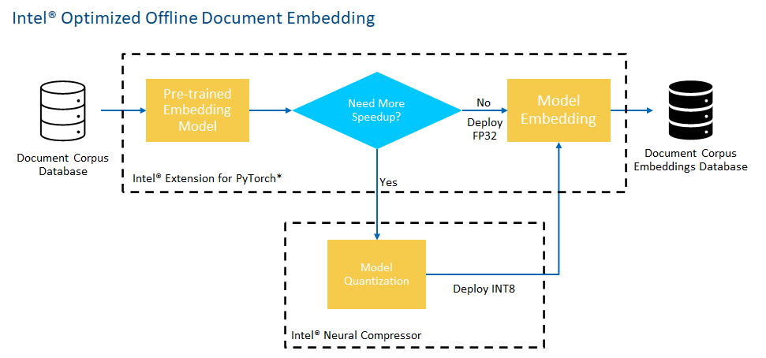
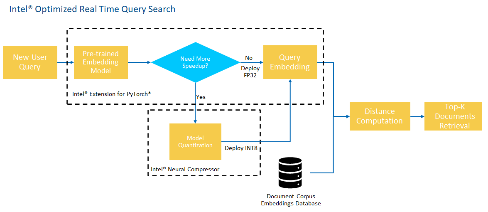

PROJECT NOT UNDER ACTIVE MANAGEMENT

This project will no longer be maintained by Intel.

Intel has ceased development and contributions including, but not limited to, maintenance, bug fixes, new releases, or updates, to this project.  

Intel no longer accepts patches to this project.

If you have an ongoing need to use this project, are interested in independently developing it, or would like to maintain patches for the open source software community, please create your own fork of this project.  

Contact: webadmin@linux.intel.com
# Vertical Search Engine

## Introduction

Build an optimized Semantic Vertical Seach Engine to automate text detection and determinate semantical similarity between two documents using Intel® Extension for PyTorch\* and Intel® Neural Compressor toolkit. Check out the [Developer Catalog](https://developer.intel.com/aireferenceimplementations) for information about different use cases.

## Solution Technical Overview

Semantic search systems are an improvement on traditional keyword-based search systems that enable the use of the contextual meaning within a query to find matching documents in a more intelligent way [[1]](#madhu_2011).  These systems have been shown to provide better results and user experiences, especially when queries are specified in a Natural Language (NL) format.  The key component in building effective semantic search systems is a method to transform queries and documents from text form into a form that captures semantic meaning [[2]](#anita_2019). 

Semantic search looks to match the meaning of words in a query (sentence or complete document), meanwhile traditional key word-based search systems only look for an exact word, its synonyms or a similar word. It makes semantic search a more powerful technology for documents meaning interpretation. The benefits of semantic search resides in improved search experience because it considers intent and context, resulting in a more like-human interaction. This might be used to boost tasks for search retrospective in reports like sales or customer satisfactions interviews, which might speed decision tasks to conduit in the right way the business of a company.

In a semantic search pipeline the input is a flow of words, either a query or a complete document, that is procesed by a pre-trained model to obtain a dense vector that is used to determine semantical similarity to a reference asset. 

Large Language Models (LLM) scales Pre-trained Language Models (PLM) in model or data size to improve model capacity. Once the parameter scale gets certain level, the model can perform context learning [[3]](#wayne_2023). Pre-trained representations are very effective in semantic feature for NLP tasks, chiefly those based on Transformers architecture [[4]](#vaswani_2017) like BERT [[5]](#devlin_2018). 

This reference kit presents an implementation of a Deep Learning (DL) based Natural Language Processing (NLP) pipeline for semantic search of an organization’s documents through a method that uses pre-trained Large Language Models (LLM) based on BERT to ingest raw text and transform it into a high dimensional dense vector embedding. Once a body of text is mapped to this vector space, distances can be computed between queries and documents to determine how semantically similar two documents are. This method consists of two primary components: Offline encoding of Documents and Real time Semantic Search. 

The proposed solution considers the scale demands of a production environment by boosting the performance of the semantic search process using the following packages: 

* ***Intel® Distribution for Python\****

  The [Intel® Distribution for Python\*](https://www.intel.com/content/www/us/en/developer/tools/oneapi/distribution-for-python.html) provides:

    * Scalable performance using all available CPU cores on laptops, desktops, and powerful servers
    * Support for the latest CPU instructions
    * Near-native performance through acceleration of core numerical and machine learning packages with libraries like the Intel® oneAPI Math Kernel Library (oneMKL) and Intel® oneAPI Data Analytics Library
    * Productivity tools for compiling Python\* code into optimized instructions
    * Essential Python\* bindings for easing integration of Intel® native tools with your Python\* project

* ***Intel® Extension for PyTorch\****

  With a few lines of code, you can use [Intel® Extension for PyTorch\*](https://www.intel.com/content/www/us/en/developer/tools/oneapi/optimization-for-pytorch.html#gs.5vjhbw) to:
    * Take advantage of the most up-to-date Intel software and hardware optimizations for PyTorch\*.
    * Automatically mix different precision data types to reduce the model size and computational workload for inference.
    * Add your own performance customizations using APIs.

* ***Intel® Neural Compressor***

  [Intel® Neural Compressor](https://www.intel.com/content/www/us/en/developer/tools/oneapi/neural-compressor.html#gs.5vjr1p) performs model compression to reduce the model size and increase the speed of deep learning inference for deployment on CPUs or GPUs. This open source Python\* library automates popular model compression technologies, such as quantization, pruning, and knowledge distillation across multiple deep learning frameworks.

By combining the use of pre-trained DL models and Intel® optimization packages, this reference kit can be leveraged as a useful resource for the machine learning practitioner looking to easily build and deploy a custom system optimized to accurately extract semantic similarity between documents.

In the [Solution Technical Details](#solution-technical-details) section, the interested reader can find a more thorough technical discussion regarding the semantic search solution presented in this reference kit, while the components of the Vertical Search Engine workflow are described in the [How it Works section](#how-it-works), along with an explanation on how Intel® Extension for PyTorch\* and Intel® Neural Compressor are useful in boosting the training and inference performance of the system.

For more details, visit [Intel® Distribution for Python](https://www.intel.com/content/www/us/en/developer/tools/oneapi/distribution-for-python.html), [Intel® Extension for PyTorch\*](https://www.intel.com/content/www/us/en/developer/tools/oneapi/optimization-for-pytorch.html#gs.5vjhbw), [Intel® Neural Compressor](https://www.intel.com/content/www/us/en/developer/tools/oneapi/neural-compressor.html#gs.5vjr1p), and the [Vertical Search Engine](https://github.com/oneapi-src/vertical-search-engine) GitHub repository.


## Solution  Technical Details
In this section, the reader can find a more in depth explanation about the semantic recognition task from the proposed Vertical Search Engine. A description of the dataset used in the workflow is also presented.

### Pre-trained Large Language Models

LLM are a key component to perform semantic search tasks. The motivation behind using these models lies in the enhanced user experiance, resembling human interaction, for NLP tasks.  

In this reference kit, the interested reader can find a demonstration of one state-of-the-art method that uses pre-trained LLM, based on BERT and provided by the `sentence_transformers`/ package. This LLM receives raw text and transforms it into a high dimensional dense vector embedding. The output is a new representation of the document that effectively captures semantic meaning due to the semi-supervised techniques employed to initially train the models. With the text mapped to this vector space, distances are computed between queries and documents to get those with high semantic similarity.

Specifically, the LLM used is `sentence-transformers/msmarco-distilbert-base-tas-b`, which has been pre-trained on a corpus of real search queries and provides good out of the box performance on many information retrieval tasks that use English natural language phrases.

The pipeline for building a semantic vertical search engine using this method consists of two primary components:

1. Offline Encoding of Documents

    This offline pipeline takes all documents that an organization owns (the corpus) and embeds them using the Large Language Model to a vector representation, saving them for later use in the 2nd pipeline.

    

2. Real Time Semantic Search

    In the realtime pipeline, a user query is taken into the system, embedded using the same Large Language Model, and distances are computed from it to all of the saved corpus embeddings produced from the 1st pipeline.  The smallest distance corpus entries are returned as semantically similar matches.

    

In some situations, an organization may also wish to fine-tune and retrain the pre-trained model with their own specialized dataset in order to improve the performance of the model to documents that an organization may have.  For example, if an organization's documents are largely financial in nature, it could be useful to fine-tune these models so that they become aware of domain-specific jargon related to financial transactions or common phrases.  In this reference kit, we do not demonstrate this process but more information on training and transfer learning techniques can be found at https://www.sbert.net/examples/training/sts/README.html.

Moreover, if companies aim to enhance capabilities centered around the vertical search engine, it can serve as a retriever for custom documentation. The results from this retriever can subsequently be input into a large language model, enabling context-aware responses to build a high quality chatbot.


### Re-ranking

In this reference kit, we focus on the document retrieval aspect of building a vertical search engine to obtain an initial list of the top-K most similar documents in the corpus for a given query.  Often times, this is sufficient for building a feature rich system.  However, in some situations, a 3rd component,  the re-ranker, could be added to the search pipeline to improve results. In this architecture, for a given query, the *document retrieval* step will use one model to rapidly obtain a list of the top-K documents, followed by a *re-ranking* step which will use a different model to re-order the list of K retrieved documents before returning to the user.  The second re-ranking refinement step has been shown to improve user satisfaction, especially when fine-tuned on a custom corpus, but may be unnecessary as a starting point for building a functional vertical search engine.  To know more about re-ranker, we direct you to https://www.sbert.net/examples/applications/retrieve_rerank/README.html for further details. In this reference kit we use `cross-encoder/ms-marco-MiniLM-L-6-v2` model as re-ranker. For more details about different re-ranker models visit https://www.sbert.net/docs/pretrained-models/ce-msmarco.html.


### Dataset

The dataset used for demonstration in this reference implementation is a question-answering dataset called HotpotQA [[6]](#yang_2018) constructed from a corpus of short answers and a set of queries built on top of the corpus.  This is a diverse dataset without any focus on a particular area.  The original source of the dataset can be found at https://hotpotqa.github.io/.

For demonstration purposes, we will be truncating the document corpus for this dataset from ~2M entries to 200k for embedding, and 5k for quantization experiments.  To prepare the dataset for use, you can use the provided `data/download_data.py` script which downloads a pre-compiled version of this dataset using the `dataset` package provided by HuggingFace and distributed by the Benchmarking IR project (https://github.com/beir-cellar/beir [[7]](#thakur_2021)).

> **Please see this dataset's applicable license for terms and conditions. Intel Corporation does not own the rights to this dataset and does not confer any rights to it.**
> **HotpotQA is distributed under a [CC BY-SA 4.0 License](https://creativecommons.org/licenses/by-sa/4.0/).**


## Validated Hardware Details

There are workflow-specific hardware and software setup requirements depending on
how the workflow is run. 

| Recommended Hardware                                            | Precision
| ----------------------------------------------------------------|-
| CPU: Intel® 2nd Gen Xeon® Platinum 8280 CPU @ 2.70GHz or higher | FP32, INT8
| RAM: 187 GB                                                     |
| Recommended Free Disk Space: 20 GB or more                      |

Code was tested on Ubuntu\* 22.04 LTS.


## How it Works

The reference kit implementation is a reference solution to the described use case that includes an optimized reference E2E architecture enabled with Intel® Extension for PyTorch\* and Intel® Neural Compressor available as part of Intel® AI Analytics Toolkit. 

### Intel® Optimized Offline Document Embedding Decision Flow

This reference solution starts by using the pre-trained Large Language Model to convert, or embed, every single document in the corpus to a dense vector.  The resulting embeddings will be stored in a file for use in the real time semantic search component.  For this purpose, and because the document corpus is not massive, these will be stored  into a file as a `numpy` array of dimension `n_docs x embedding_dim`.  In larger production pipelines, these can be stored in a database that allows for vector embeddings.




### Intel® Optimized Offline Real Time Query Search Decision Flow

When a new query arrives into the system, it passes into the same pre-trained Large Language Model to create a dense vector embedding of it.  After loading the `numpy` array of document embeddings from the offline component, it computes the cosine similarity score between the query and each document.  From this, it returns the K closest based on the similarity score.




#### Intel® Extension for PyTorch*

The Intel® Extension for PyTorch\* extends PyTorch\* with optimizations for an extra performance boost on Intel® hardware. Most of the optimizations will be included in stock PyTorch\* releases eventually, and the intention of the extension is to deliver up-to-date features and optimizations for PyTorch\* on Intel® hardware, examples include AVX-512 Vector Neural Network Instructions (AVX512 VNNI) and Intel® Advanced Matrix Extensions (Intel® AMX).

The Intel® Extension for PyTorch\* can be used to optimize some PyTorch\* model architectures for Intel® CPU architectures and instruction sets.  These optimizations include **additional CPU specific optimizations**.  This optimized reference implementation optimizes the embedding scripts using both of these methods.  More details about this package can be found at [the Intel® Extension for PyTorch\* github](https://github.com/intel/intel-extension-for-pytorch).

***Additional CPU Specific Optimizations***

Many of the Intel® optimizations for PyTorch\* are directly upstreamed to the main PyTorch\* project.  These optimizations can directly be utilized by updating the version of PyTorch\* that is being used.  In addition to the upstreamed optimizations, the Intel® Extension for PyTorch\* provides additional CPU specific optimizations to a PyTorch\* model that are not upstreamed and can be applied via few modifications to the code. These additional optimizations are directly implemented in both the `run_document_embedding.py` and the `run_query_search.py` scripts.

Maximizing the performance of these optimizations depends on the details of the runtime machine.  The Intel® Extension for PyTorch\* provides a command line launch script, `ipexrun`, to automatically detect and configure some of the optimizations settings based on your machine.  More information about this can be found at the [Intel® Extension for PyTorch\* launch script usage guide](https://intel.github.io/intel-extension-for-pytorch/cpu/latest/tutorials/performance_tuning/launch_script.html).  In the following sections, it defaults to use `ipexrun` to automatically configure the optimizations to our environment. 


#### Intel® Neural Compressor

Intel® Neural Compressor is an open-source Python* library designed to help you quickly deploy low-precision inference solutions on popular Deep Learning frameworks such as TensorFlow*, PyTorch\*, MXNet*, and ONNX* (Open Neural Network Exchange) runtime. The tool automatically optimizes low-precision recipes for Deep Learning models to achieve optimal product objectives, such as inference performance and memory usage, with expected accuracy criteria.


## Get Started

Start by **defining an environment variable** that will store the workspace path, this can be an existing directory or one to be created in further steps. This ENVVAR will be used for all the commands executed using absolute paths.

[//]: # (capture: baremetal)
```bash
export WORKSPACE=$PWD/vertical-search-engine
```

Also, it is necessary to define the following environment variables to correctly setup this reference kit

[//]: # (capture: baremetal)
```bash
export DATA_DIR=$WORKSPACE/data
export OUTPUT_DIR=$WORKSPACE/output 
```

**DATA_DIR:** This path will contain all the directories and files required to manage the dataset. 

**OUTPUT_DIR:** This path will contain the multiple outputs generated by the workflow, e.g. quantized model, rankings.json, etc.

### Download the Workflow Repository
Create the workspace directory for the workflow and clone the [Vertical Search Engine]() repository inside it.

[//]: # (capture: baremetal)
```bash
mkdir -p $WORKSPACE && cd $WORKSPACE
```

```bash
git clone https://github.com/oneapi-src/vertical-search-engine.git $WORKSPACE
```

### Set Up Conda
Please follow the instructions below to download and install Miniconda.

1. Download the required Miniconda installer for Linux.
   
   ```bash
   wget https://repo.anaconda.com/miniconda/Miniconda3-latest-Linux-x86_64.sh
   ```

2. Install Miniconda.
   
   ```bash
   bash Miniconda3-latest-Linux-x86_64.sh
   ```

3. Delete Miniconda installer.
   
   ```bash
   rm Miniconda3-latest-Linux-x86_64.sh
   ```

Please visit [Conda Installation on Linux](https://docs.anaconda.com/free/anaconda/install/linux/) for more details. 

### Set Up Environment
Execute the next commands to install and setup libmamba as conda's default solver.

```bash
conda install -n base conda-libmamba-solver
conda config --set solver libmamba
```

| Packages | Version | 
| -------- | ------- |
| python | 3.9 |
| intel-extension-for-pytorch | 2.0.100 |
| neural-compressor| 2.3.1 |
| sentence-transformers | 2.2.2 |

The dependencies required to properly execute this workflow can be found in the yml file [$WORKSPACE/env/intel_env.yml](env/intel_env.yml).

Proceed to create the conda environment.

```bash
conda env create -f $WORKSPACE/env/intel_env.yml
```

Environment setup is required only once. This step does not cleanup the existing environment with the same name hence we need to make sure there is no conda environment with the same name. During this setup, `vertical_search_intel` conda environment will be created with the dependencies listed in the YAML configuration.

Activate the `vertical_search_intel` conda environment as follows:

```bash
conda activate vertical_search_intel
```

### Dataset
The dataset used for demonstration in this reference implementation is a question-answering dataset called HotpotQA constructed from a corpus of short answers and a set of queries built on top of the corpus. 

The following commands download the full dataset and creates a truncated versions of the original corpus for use within this reference implementation.

[//]: # (capture: baremetal)
```bash
cd $DATA_DIR
python download_data.py
cd ..
```

## Supported Runtime Environment
The execution of this reference kit is compatible with the following environments:
* Bare Metal

---

### Run Using Bare Metal
Before executing the different stages of this use case, make sure your ``conda`` environment is already configured. If you don't already have ``conda`` installed, go to [Set Up Conda](#set-up-conda), or if the ``conda`` environment is not already activated, refer to [Set Up Environment](#set-up-environment).

> *Note: It is assumed that the present working directory is the root directory of this code repository. Use the following command to go to the root directory.*

[//]: # (capture: baremetal)
```bash
cd $WORKSPACE
```

#### Run Workflow
The following subsections provide the commands to make an optimized execution of this Vertical Search Engine workflow based on Intel® Extension for PyTorch\* and Intel® Neural Compressor toolkit. As an illustrative guideline to understand how the Intel® specialized packages are used to optimize the performance of the semantic search task, please check the [How it Works](#how-it-works) section.

---
#### Optimizations with Intel® Extension for PyTorch\*

In the following sections, we will default to use `ipexrun` to automatically configure the optimizations to our environment.  

***Note***

By default, the launch script uses the `numactl` tool.  To install this, on Ubuntu machines, use `sudo apt-get install numactl`.  Alternatively, this can be disabled by adding the `--disable_numactl` flag to all of the commands that use ipexrun.  For example `ipexrun --use_logical_core --enable_tcmalloc --disable_numactl script.py [flags]`.

#### Offline Embedding of Documents Process


It uses the pre-trained `sentence-transformers/msmarco-distilbert-base-tas-b` model to embed all of the documents in a corpus into vector representations.  In order to do this, we have provided the `run_document_embedder.py` script, which *reads a model config file*, *reads the data*, *embeds the documents into a vector format*, and *saves the embeddings for future use*.

The script takes the following arguments:

```shell
usage: run_document_embedder.py [-h] [--logfile LOGFILE] --vse_config VSE_CONFIG --input_corpus INPUT_CORPUS [--output_file OUTPUT_FILE] [--batch_size BATCH_SIZE] [--benchmark_mode] [--n_runs N_RUNS]

optional arguments:
  -h, --help                      show this help message and exit
  --logfile LOGFILE               Log file to output benchmarking results to.
  --vse_config VSE_CONFIG         Vertical Search Engine model config yml
  --input_corpus INPUT_CORPUS     path to corpus to embed
  --output_file OUTPUT_FILE       file to output corpus embeddings to
  --batch_size BATCH_SIZE         batch size for embedding. defaults to 32.
  --benchmark_mode                toggle to benchmark embedding
  --n_runs N_RUNS                 number of iterations to benchmark embedding
```

Expected Input-Output for Offline Embedding of Documents:
   
| Input | Output |
| ----- | ------ |
| Text Document | Dense Vector Embedding |

Example:

| Example Input | Example Output |
| ------------- | -------------- |
| Abraham Lincoln ( ; February 12, 1809 – April 15, 1865) was an American politician and lawyer who served as the 16th President of the United States from March 1861 until his assassination in April 1865. Lincoln led the United States through its Civil War—its bloodiest war and perhaps its greatest moral, constitutional, and political crisis. In doing so, he preserved the Union, paved the way to the abolition of slavery, strengthened the federal government, and modernized the economy. | [-0.12000261, 0.01448196, ..., -0.3580838, 0.7535474] |


To perform document embedding with these additional optimizations and the `ipexrun` tool, we can run the commands:

[//]: # (capture: baremetal)
```bash
ipexrun --use_logical_core --enable_tcmalloc $WORKSPACE/src/run_document_embedder.py --vse_config $WORKSPACE/src/configs/vse_config_base.yml --input_corpus $DATA_DIR/corpus_abbreviated.csv --output_file $OUTPUT_DIR/embeddings.pkl
```
Which will embed all of the corpus entries in the corpus_abbreviated.csv file and output a saved embeddings file to `output/embeddings.pkl`.  The model config file is provided to you here, which sets the pre-trained model to use and the max sequence length.


#### Real Time Semantic Search Process

Once an embeddings file is created using the above process, the `run_query_search.py` script can be run to find the K closest documents for a set of queries provided in a queries file.

The script takes the following arguments:

```shell
usage: run_query_search.py [-h] [--logfile LOGFILE] --vse_config VSE_CONFIG --input_queries INPUT_QUERIES [--output_file OUTPUT_FILE] [--batch_size BATCH_SIZE] [--benchmark_mode] [--n_runs N_RUNS]

optional arguments:
  -h, --help                      show this help message and exit
  --logfile LOGFILE               Log file to output benchmarking results to.
  --vse_config VSE_CONFIG         Vertical Search Engine model config yml
  --input_queries INPUT_QUERIES   path to corpus to embed
  --output_file OUTPUT_FILE       file to output top k documents to
  --batch_size BATCH_SIZE         batch size for embedding
  --benchmark_mode                toggle to benchmark embedding
  --n_runs N_RUNS                 number of iterations to benchmark embedding
  --use_re_ranker                 toggle to use cross encoder re-ranker model
  --input_corpus INPUT_CORPUS     path to corpus to embed
```

Expected Input-Output for Real Time Semantic Search:

| **Input**  |                 **Output**                 |
| -------- | ---------------------------------------- |
| Text Query | Top-K Closest Document in the Corpus |

Example:

| Example Input | Example Output |
| ------------- | -------------- |
| Are Ferocactus and Sliene both type of plant?  | ``` {"query" : "Are Ferocactus and Sliene both type of plant?", results = ["Apiaceae or Umbelliferae, is a family of mostly aromatic flowering plants named after the type genus \"Apium\" and commonly known as the celery, carrot or parsley family. It is the 16th-largest family of flowering plants, with more than 3,700 species in 434 genera including such well-known and economically important plants such as angelica, anise, asafoetida, caraway, carrot, celery, chervil, coriander, cumin, dill, fennel, hemlock, lovage, cow parsley, parsley, parsnip, sea holly, giant hogweed and silphium (a plant whose identity is unclear and which may be extinct).", "Asteraceae or Compositae (commonly referred to as the aster, daisy, composite, or sunflower family) is a very large and widespread family of flowering plants (Angiospermae).", ...]}``` |


To perform realtime query search using the above set of saved corpus embeddings and the provided configuration file, which points to the saved embeddings file with these additional optimizations and the `ipexrun` tool, we can run the commands:

[//]: # (capture: baremetal)
```bash
ipexrun --use_logical_core --enable_tcmalloc $WORKSPACE/src/run_query_search.py --vse_config $WORKSPACE/src/configs/vse_config_base.yml --input_queries $DATA_DIR/test_queries.csv --output_file $OUTPUT_DIR/rankings.json --use_re_ranker --input_corpus $DATA_DIR/corpus_abbreviated.csv
```

which outputs a json file of the *the Top 10 closest document indices with scores* for each query in the provided input queries.


#### Model Quantization using Intel® Neural Compressor

Another level of optimization that we can use to accelerate our models is Model quantization.  Model quantization is the practice of converting the FP32 weights in Deep Neural Networks to a lower precision, such as INT8, in order **to accelerate computation time and reduce storage space of trained models**.  This may be useful if latency and throughput are critical, especially for larger models such as these Large Language Models. To add this feature to our reference kit, we will be using Intel® Neural Compressor (INC), an extensive library with multiple algorithms for compressing trained Deep Neural Network models.  More details can be found at https://github.com/intel/neural-compressor.  

The model compression algorithm we choose for this reference kit is Accuracy Aware Quantization, a quantization technique which adds an accuracy requirement when choosing how to convert weights from FP32 to INT8.  This is useful when a faster model is needed, but the full quantization may affect accuracy to an unacceptable degree.

The provided script, `run_quantize_inc.py`, can be used to perform Accuracy Aware Quantization of our trained PyTorch models using the configuration file `conf.yml`:

The `run_quantize_inc.py` script takes the following arguments:

```shell
usage: run_quantize_inc.py [-h] --query_file QUERY_FILE --corpus_file CORPUS_FILE --ground_truth_file GROUND_TRUTH_FILE --vse_config VSE_CONFIG [--batch_size BATCH_SIZE] --save_model_dir SAVE_MODEL_DIR --inc_config_file INC_CONFIG_FILE

optional arguments:
  -h, --help                               show this help message and exit
  --query_file QUERY_FILE                  query file to use for AAQ
  --corpus_file CORPUS_FILE                corpus file to use for AAQ
  --ground_truth_file GROUND_TRUTH_FILE    table of query-id and matching corpus-id to evaluate accuracy
  --vse_config VSE_CONFIG                  Vertical Search Engine model config yml
  --batch_size BATCH_SIZE                  batch size to use. Defaults to 32.
  --save_model_dir SAVE_MODEL_DIR          directory to save the quantized model to
  --inc_config_file INC_CONFIG_FILE        INC conf yaml
  --use_re_ranker                          toggle to use cross encoder re-ranker model
```

which can be used for our models as follows:

[//]: # (capture: baremetal)
```bash
python $WORKSPACE/src/run_quantize_inc.py --query_file $DATA_DIR/quant_queries.csv --corpus_file $DATA_DIR/corpus_quantization.csv --ground_truth_file $DATA_DIR/ground_truth_quant.csv --vse_config $WORKSPACE/src/configs/vse_config_inc.yml --save_model_dir $OUTPUT_DIR/models/inc_int8 --inc_config_file $WORKSPACE/src/conf.yml --use_re_ranker
```

to output a quantized model, if successful, to `$OUTPUT_DIR/models/inc_int8/`.

As our data comes with a ground truth file only containing an un-ranked list of queries and their correctly retrieved corpus results, the accuracy metric we consider here is the ability for the model to retrieve the ground truth corpus entries for a given query within it's top K, also known as Recall@K.  This can be defined, letting $D$ be the number of ground truth entries, as:

<!--
$$
\text{Recall@K} = \sum_{i = 1}^{D} \frac{\{\text{1, if ground truth document $i$ for query $j$ is in Top-K retrieved documents for query $j$, else 0}\}}{\vert D \vert} 
$$
Here, D is the total number of entries in the ground truth file.
-->


[Many more information retrieval metrics](https://en.wikipedia.org/wiki/Evaluation_measures_(information_retrieval)) can be used aside from the one we use to calibrate the quantized model according to your application needs.

For accuracy aware quantization, we set the maximum Recall@5 drop to 1% and quantize the model until it can achieve that level of accuracy.

From our experiments, on the quantization dataset, the original FP32 model obtains a Recall@5 of 90% while the model quantized with Intel® Neural Compressor obtains a Recall@5 of 89%, but offers significant computational benefits. 


#### Offline Document Embedding and Realtime Query Search Using Intel® Neural Compressor Quantized Model

The quantized model can be easily be used for embedding and query searching using the same previous scripts, but passing in the newly saved INC model via the `--vse_config` file, which we have included a default version for.

To do offline document embedding, we can run the commands: 

[//]: # (capture: baremetal)
```bash
ipexrun --use_logical_core --enable_tcmalloc $WORKSPACE/src/run_document_embedder.py --vse_config $WORKSPACE/src/configs/vse_config_inc.yml --input_corpus $DATA_DIR/corpus_abbreviated.csv --output_file $OUTPUT_DIR/embeddings.pkl
```

To do realtime query searching, we can run the commands:

[//]: # (capture: baremetal)
```bash
ipexrun --use_logical_core --enable_tcmalloc $WORKSPACE/src/run_query_search.py --vse_config $WORKSPACE/src/configs/vse_config_inc.yml --input_queries $DATA_DIR/test_queries.csv --output_file $OUTPUT_DIR/rankings.json --use_re_ranker --input_corpus $DATA_DIR/corpus_abbreviated.csv
```

#### Displaying Results

For convenience sake, we have included the `display_rankings.py` script to better print the rankings:.

The script takes the following arguments:

```shell
usage: display_rankings.py [-h] --rankings_file RANKINGS_FILE --queries QUERIES --corpus CORPUS

optional arguments:
  -h, --help                       show this help message and exit
  --rankings_file RANKINGS_FILE    rankings from query search
  --queries QUERIES                raw queries file
  --corpus CORPUS                  raw corpus file
```

We can pretty-print the rankings saved to the `rankings.json` using the commands:

[//]: # (capture: baremetal)
```bash
python $WORKSPACE/src/display_rankings.py --rankings_file $OUTPUT_DIR/rankings.json --queries $DATA_DIR/test_queries.csv --corpus $DATA_DIR/corpus_abbreviated.csv
```

which will pretty-print the rankings in JSON format and can be redirected to another file to save the results.


#### Clean Up Bare Metal
The next commands are useful to remove the previously generated conda environment, as well as the dataset and the multiple models and files created during the workflow execution. Before proceeding with the cleanup process, it is recommended to backing up the data you want to preserve.

```bash
conda deactivate #Run this line if the vertical_search_intel environment is still active
conda env remove -n vertical_search_intel
rm $OUTPUT_DIR $DATA_DIR $WORKSPACE -rf
```

---
### Expected Output
A successful execution of the different stages of this workflow should produce outputs similar to the following:

### Dataset Download

```
(vertical_search_intel) root@45d9e2a7af58://vertical-search-engine/data# python download_data.py
Downloading data: 100%|██████████| 327M/327M [00:54<00:00, 5.99MB/s]
Downloading data: 100%|██████████| 311M/311M [00:44<00:00, 7.05MB/s]
Downloading data: 100%|██████████| 311M/311M [00:43<00:00, 7.08MB/s]
Downloading data: 100%|██████████| 76.5M/76.5M [00:12<00:00, 5.95MB/s]
Generating corpus split: 100%|██████████| 5233329/5233329 [00:05<00:00, 906668.70 examples/s]
Downloading data: 100%|██████████| 9.01M/9.01M [00:02<00:00, 3.47MB/s]
Generating queries split: 100%|██████████| 97852/97852 [00:00<00:00, 1713972.65 examples/s]
Downloading readme: 100%|██████████| 14.0k/14.0k [00:00<00:00, 25.1MB/s]
Downloading data: 100%|██████████| 6.12M/6.12M [00:01<00:00, 4.69MB/s]
Downloading data: 100%|██████████| 392k/392k [00:00<00:00, 2.48MB/s]
Downloading data: 100%|██████████| 533k/533k [00:00<00:00, 2.21MB/s]
Generating train split: 170000 examples [00:00, 1113581.31 examples/s]
Generating validation split: 10894 examples [00:00, 793828.14 examples/s]
Generating test split: 14810 examples [00:00, 922776.79 examples/s]
```

#### Regular Offline Document Embedding with Intel® Extension for PyTorch\*

```
(vertical_search_intel) root@11c67c492bac://vertical-search-engine# ipexrun --use_logical_core --enable_tcmalloc $WORKSPACE/src/run_document_embedder.py --vse_config $WORKSPACE/src/configs/vse_config_base.yml --input_corpus $DATA_DIR/corpus_abbreviated.csv --output_file $OUTPUT_DIR/embeddings.pkl 
/root/miniconda3/envs/vertical_search_intel/lib/python3.9/site-packages/torchvision/io/image.py:13: UserWarning: Failed to load image Python extension: '/root/miniconda3/envs/vertical_search_intel/lib/python3.9/site-packages/torchvision/image.so: undefined symbol: _ZN5torch3jit17parseSchemaOrNameERKNSt7__cxx1112basic_stringIcSt11char_traitsIcESaIcEEE'If you don't plan on using image functionality from `torchvision.io`, you can ignore this warning. Otherwise, there might be something wrong with your environment. Did you have `libjpeg` or `libpng` installed before building `torchvision` from source?
  warn(
2024-01-26 16:19:28,729 - intel_extension_for_pytorch.cpu.launch.__main__ - WARNING - Argument --use_logical_core is deprecated by --use-logical-cores.
2024-01-26 16:19:28,729 - intel_extension_for_pytorch.cpu.launch.__main__ - WARNING - Arguments --enable_tcmalloc, --enable_jemalloc and --use_default_allocator are deprecated by --memory-allocator.
2024-01-26 16:19:28,730 - intel_extension_for_pytorch.cpu.launch.__main__ - INFO - Use 'tcmalloc' memory allocator.
2024-01-26 16:19:28,730 - intel_extension_for_pytorch.cpu.launch.__main__ - INFO - Use 'auto' => 'intel' OpenMP runtime.
2024-01-26 16:19:28,744 - intel_extension_for_pytorch.cpu.launch.__main__ - INFO - Use 'auto' => 'taskset' multi-task manager.
2024-01-26 16:19:28,744 - intel_extension_for_pytorch.cpu.launch.__main__ - INFO - env: Untouched preset environment variables are not displayed.
2024-01-26 16:19:28,744 - intel_extension_for_pytorch.cpu.launch.__main__ - INFO - env: LD_PRELOAD=/root/miniconda3/envs/vertical_search_intel/lib/libtcmalloc.so:/root/miniconda3/envs/vertical_search_intel/lib/libiomp5.so
2024-01-26 16:19:28,744 - intel_extension_for_pytorch.cpu.launch.__main__ - INFO - env: KMP_BLOCKTIME=1
2024-01-26 16:19:28,744 - intel_extension_for_pytorch.cpu.launch.__main__ - INFO - env: OMP_NUM_THREADS=48
2024-01-26 16:19:28,744 - intel_extension_for_pytorch.cpu.launch.__main__ - INFO - cmd: taskset -c 0-47 /root/miniconda3/envs/vertical_search_intel/bin/python -u //vertical-search-engine/src/run_document_embedder.py --vse_config //vertical-search-engine/src/configs/vse_config_base.yml --input_corpus //vertical-search-engine/data/corpus_abbreviated.csv --output_file //vertical-search-engine/output/embeddings.pkl 
2024-01-26 16:19:28,745 - intel_extension_for_pytorch.cpu.launch.__main__ - WARNING - Cross NUMA nodes execution detected: cores [0-47] are on different NUMA nodes [0,1]
DEBUG:urllib3.connectionpool:Starting new HTTPS connection (1): huggingface.co:443
DEBUG:urllib3.connectionpool:https://huggingface.co:443 "HEAD /sentence-transformers/msmarco-distilbert-base-tas-b/resolve/main/tokenizer_config.json HTTP/1.1" 200 0
DEBUG:filelock:Attempting to acquire lock 139926189747264 on /root/.cache/huggingface/hub/.locks/models--sentence-transformers--msmarco-distilbert-base-tas-b/0ee62a214c1dc054319327b7b588d19436847ad6.lock
DEBUG:filelock:Lock 139926189747264 acquired on /root/.cache/huggingface/hub/.locks/models--sentence-transformers--msmarco-distilbert-base-tas-b/0ee62a214c1dc054319327b7b588d19436847ad6.lock
DEBUG:urllib3.connectionpool:https://huggingface.co:443 "GET /sentence-transformers/msmarco-distilbert-base-tas-b/resolve/main/tokenizer_config.json HTTP/1.1" 200 547
tokenizer_config.json: 100%|███████████████████████████████████████████████████████████████████████████████████████████████████████████████████████████████████████████████| 547/547 [00:00<00:00, 69.9kB/s]
DEBUG:filelock:Attempting to release lock 139926189747264 on /root/.cache/huggingface/hub/.locks/models--sentence-transformers--msmarco-distilbert-base-tas-b/0ee62a214c1dc054319327b7b588d19436847ad6.lock
DEBUG:filelock:Lock 139926189747264 released on /root/.cache/huggingface/hub/.locks/models--sentence-transformers--msmarco-distilbert-base-tas-b/0ee62a214c1dc054319327b7b588d19436847ad6.lock
DEBUG:urllib3.connectionpool:https://huggingface.co:443 "HEAD /sentence-transformers/msmarco-distilbert-base-tas-b/resolve/main/config.json HTTP/1.1" 200 0
DEBUG:filelock:Attempting to acquire lock 139925267929792 on /root/.cache/huggingface/hub/.locks/models--sentence-transformers--msmarco-distilbert-base-tas-b/2a87b6d6f77ebd753b9c52746a38cdef645701e3.lock
DEBUG:filelock:Lock 139925267929792 acquired on /root/.cache/huggingface/hub/.locks/models--sentence-transformers--msmarco-distilbert-base-tas-b/2a87b6d6f77ebd753b9c52746a38cdef645701e3.lock
DEBUG:urllib3.connectionpool:https://huggingface.co:443 "GET /sentence-transformers/msmarco-distilbert-base-tas-b/resolve/main/config.json HTTP/1.1" 200 548
config.json: 100%|██████████████████████████████████████████████████████████████████████████████████████████████████████████████████████████████████████████████████████████| 548/548 [00:00<00:00, 196kB/s]
DEBUG:filelock:Attempting to release lock 139925267929792 on /root/.cache/huggingface/hub/.locks/models--sentence-transformers--msmarco-distilbert-base-tas-b/2a87b6d6f77ebd753b9c52746a38cdef645701e3.lock
DEBUG:filelock:Lock 139925267929792 released on /root/.cache/huggingface/hub/.locks/models--sentence-transformers--msmarco-distilbert-base-tas-b/2a87b6d6f77ebd753b9c52746a38cdef645701e3.lock
DEBUG:urllib3.connectionpool:https://huggingface.co:443 "HEAD /sentence-transformers/msmarco-distilbert-base-tas-b/resolve/main/vocab.txt HTTP/1.1" 200 0
DEBUG:filelock:Attempting to acquire lock 139925258309104 on /root/.cache/huggingface/hub/.locks/models--sentence-transformers--msmarco-distilbert-base-tas-b/fb140275c155a9c7c5a3b3e0e77a9e839594a938.lock
DEBUG:filelock:Lock 139925258309104 acquired on /root/.cache/huggingface/hub/.locks/models--sentence-transformers--msmarco-distilbert-base-tas-b/fb140275c155a9c7c5a3b3e0e77a9e839594a938.lock
DEBUG:urllib3.connectionpool:https://huggingface.co:443 "GET /sentence-transformers/msmarco-distilbert-base-tas-b/resolve/main/vocab.txt HTTP/1.1" 200 231508
vocab.txt: 100%|█████████████████████████████████████████████████████████████████████████████████████████████████████████████████████████████████████████████████████████| 232k/232k [00:00<00:00, 38.9MB/s]
DEBUG:filelock:Attempting to release lock 139925258309104 on /root/.cache/huggingface/hub/.locks/models--sentence-transformers--msmarco-distilbert-base-tas-b/fb140275c155a9c7c5a3b3e0e77a9e839594a938.lock
DEBUG:filelock:Lock 139925258309104 released on /root/.cache/huggingface/hub/.locks/models--sentence-transformers--msmarco-distilbert-base-tas-b/fb140275c155a9c7c5a3b3e0e77a9e839594a938.lock
DEBUG:urllib3.connectionpool:https://huggingface.co:443 "HEAD /sentence-transformers/msmarco-distilbert-base-tas-b/resolve/main/tokenizer.json HTTP/1.1" 200 0
DEBUG:filelock:Attempting to acquire lock 139925258361680 on /root/.cache/huggingface/hub/.locks/models--sentence-transformers--msmarco-distilbert-base-tas-b/40c4a0f6c414c8218190234bbce9bf4cc04fa3ac.lock
DEBUG:filelock:Lock 139925258361680 acquired on /root/.cache/huggingface/hub/.locks/models--sentence-transformers--msmarco-distilbert-base-tas-b/40c4a0f6c414c8218190234bbce9bf4cc04fa3ac.lock
DEBUG:urllib3.connectionpool:https://huggingface.co:443 "GET /sentence-transformers/msmarco-distilbert-base-tas-b/resolve/main/tokenizer.json HTTP/1.1" 200 466081
tokenizer.json: 100%|████████████████████████████████████████████████████████████████████████████████████████████████████████████████████████████████████████████████████| 466k/466k [00:00<00:00, 68.9MB/s]
DEBUG:filelock:Attempting to release lock 139925258361680 on /root/.cache/huggingface/hub/.locks/models--sentence-transformers--msmarco-distilbert-base-tas-b/40c4a0f6c414c8218190234bbce9bf4cc04fa3ac.lock
DEBUG:filelock:Lock 139925258361680 released on /root/.cache/huggingface/hub/.locks/models--sentence-transformers--msmarco-distilbert-base-tas-b/40c4a0f6c414c8218190234bbce9bf4cc04fa3ac.lock
DEBUG:urllib3.connectionpool:https://huggingface.co:443 "HEAD /sentence-transformers/msmarco-distilbert-base-tas-b/resolve/main/added_tokens.json HTTP/1.1" 404 0
DEBUG:urllib3.connectionpool:https://huggingface.co:443 "HEAD /sentence-transformers/msmarco-distilbert-base-tas-b/resolve/main/special_tokens_map.json HTTP/1.1" 200 0
DEBUG:filelock:Attempting to acquire lock 139925258361392 on /root/.cache/huggingface/hub/.locks/models--sentence-transformers--msmarco-distilbert-base-tas-b/e7b0375001f109a6b8873d756ad4f7bbb15fbaa5.lock
DEBUG:filelock:Lock 139925258361392 acquired on /root/.cache/huggingface/hub/.locks/models--sentence-transformers--msmarco-distilbert-base-tas-b/e7b0375001f109a6b8873d756ad4f7bbb15fbaa5.lock
DEBUG:urllib3.connectionpool:https://huggingface.co:443 "GET /sentence-transformers/msmarco-distilbert-base-tas-b/resolve/main/special_tokens_map.json HTTP/1.1" 200 112
special_tokens_map.json: 100%|█████████████████████████████████████████████████████████████████████████████████████████████████████████████████████████████████████████████| 112/112 [00:00<00:00, 46.5kB/s]
DEBUG:filelock:Attempting to release lock 139925258361392 on /root/.cache/huggingface/hub/.locks/models--sentence-transformers--msmarco-distilbert-base-tas-b/e7b0375001f109a6b8873d756ad4f7bbb15fbaa5.lock
DEBUG:filelock:Lock 139925258361392 released on /root/.cache/huggingface/hub/.locks/models--sentence-transformers--msmarco-distilbert-base-tas-b/e7b0375001f109a6b8873d756ad4f7bbb15fbaa5.lock
DEBUG:urllib3.connectionpool:https://huggingface.co:443 "HEAD /sentence-transformers/msmarco-distilbert-base-tas-b/resolve/main/config.json HTTP/1.1" 200 0
DEBUG:urllib3.connectionpool:https://huggingface.co:443 "HEAD /sentence-transformers/msmarco-distilbert-base-tas-b/resolve/main/model.safetensors HTTP/1.1" 404 0
DEBUG:urllib3.connectionpool:https://huggingface.co:443 "HEAD /sentence-transformers/msmarco-distilbert-base-tas-b/resolve/main/model.safetensors.index.json HTTP/1.1" 404 0
DEBUG:urllib3.connectionpool:https://huggingface.co:443 "HEAD /sentence-transformers/msmarco-distilbert-base-tas-b/resolve/main/pytorch_model.bin HTTP/1.1" 302 0
DEBUG:filelock:Attempting to acquire lock 139925251934288 on /root/.cache/huggingface/hub/.locks/models--sentence-transformers--msmarco-distilbert-base-tas-b/069584b7fd2d6dcefb5d97b9aa682332430e311921ef9f928cb61f63a44a267e.lock
DEBUG:filelock:Lock 139925251934288 acquired on /root/.cache/huggingface/hub/.locks/models--sentence-transformers--msmarco-distilbert-base-tas-b/069584b7fd2d6dcefb5d97b9aa682332430e311921ef9f928cb61f63a44a267e.lock
DEBUG:urllib3.connectionpool:Starting new HTTPS connection (1): cdn-lfs.huggingface.co:443
DEBUG:urllib3.connectionpool:https://cdn-lfs.huggingface.co:443 "GET /sentence-transformers/msmarco-distilbert-base-tas-b/069584b7fd2d6dcefb5d97b9aa682332430e311921ef9f928cb61f63a44a267e?response-content-disposition=attachment%3B+filename*%3DUTF-8%27%27pytorch_model.bin%3B+filename%3D%22pytorch_model.bin%22%3B&response-content-type=application%2Foctet-stream&Expires=1706545178&Policy=eyJTdGF0ZW1lbnQiOlt7IkNvbmRpdGlvbiI6eyJEYXRlTGVzc1RoYW4iOnsiQVdTOkVwb2NoVGltZSI6MTcwNjU0NTE3OH19LCJSZXNvdXJjZSI6Imh0dHBzOi8vY2RuLWxmcy5odWdnaW5nZmFjZS5jby9zZW50ZW5jZS10cmFuc2Zvcm1lcnMvbXNtYXJjby1kaXN0aWxiZXJ0LWJhc2UtdGFzLWIvMDY5NTg0YjdmZDJkNmRjZWZiNWQ5N2I5YWE2ODIzMzI0MzBlMzExOTIxZWY5ZjkyOGNiNjFmNjNhNDRhMjY3ZT9yZXNwb25zZS1jb250ZW50LWRpc3Bvc2l0aW9uPSomcmVzcG9uc2UtY29udGVudC10eXBlPSoifV19&Signature=Dt~bVbrBNVmYzk3U6LlZvxAXrvYizeJGLUt52RhLl0EXw~0YYSc7unhLADoEbTqd4s7-ZUsXRoh23KmklzuQlGRxddP0~kdZyna0Q2MtTh1uDudMIaUh-ejBRXV43FU6fdjEmr4QqApdJxGBBVEBOpXfwlTzy7NE6L-RIf2SXEx-dh6UEcYDQlfnlt1tcGjO8aaB4bxSyifUy4z0HYJSvvor7u5m5Gscpy~fNGGU8B087y9CbjdGcOIZSGJ4~yKEjvMIM3f9Z0dKjYu~38qCq4261mRxVNx88Z-tPrvWiuTOiEe5S4KmIQBnW~o4lllh28bHp4MtJ1VNxHbLbtMyag__&Key-Pair-Id=KVTP0A1DKRTAX HTTP/1.1" 200 265486777
pytorch_model.bin: 100%|██████████████████████████████████████████████████████████████████████████████████████████████████████████████████████████████████████████████████| 265M/265M [00:02<00:00, 103MB/s]
DEBUG:filelock:Attempting to release lock 139925251934288 on /root/.cache/huggingface/hub/.locks/models--sentence-transformers--msmarco-distilbert-base-tas-b/069584b7fd2d6dcefb5d97b9aa682332430e311921ef9f928cb61f63a44a267e.lock
DEBUG:filelock:Lock 139925251934288 released on /root/.cache/huggingface/hub/.locks/models--sentence-transformers--msmarco-distilbert-base-tas-b/069584b7fd2d6dcefb5d97b9aa682332430e311921ef9f928cb61f63a44a267e.lock
/root/miniconda3/envs/vertical_search_intel/lib/python3.9/site-packages/torchvision/io/image.py:13: UserWarning: Failed to load image Python extension: '/root/miniconda3/envs/vertical_search_intel/lib/python3.9/site-packages/torchvision/image.so: undefined symbol: _ZN5torch3jit17parseSchemaOrNameERKNSt7__cxx1112basic_stringIcSt11char_traitsIcESaIcEEE'If you don't plan on using image functionality from `torchvision.io`, you can ignore this warning. Otherwise, there might be something wrong with your environment. Did you have `libjpeg` or `libpng` installed before building `torchvision` from source?
  warn(
/root/miniconda3/envs/vertical_search_intel/lib/python3.9/site-packages/intel_extension_for_pytorch/frontend.py:474: UserWarning: Conv BatchNorm folding failed during the optimize process.
  warnings.warn("Conv BatchNorm folding failed during the optimize process.")
/root/miniconda3/envs/vertical_search_intel/lib/python3.9/site-packages/intel_extension_for_pytorch/frontend.py:479: UserWarning: Linear BatchNorm folding failed during the optimize process.
  warnings.warn("Linear BatchNorm folding failed during the optimize process.")
/root/miniconda3/envs/vertical_search_intel/lib/python3.9/site-packages/transformers/models/distilbert/modeling_distilbert.py:223: TracerWarning: torch.tensor results are registered as constants in the trace. You can safely ignore this warning if you use this function to create tensors out of constant variables that would be the same every time you call this function. In any other case, this might cause the trace to be incorrect.
  mask, torch.tensor(torch.finfo(scores.dtype).min)
100%|███████████████████████████████████████████████████████████████████████████████████████████████████████████████████████████████████████████████████████████████████| 6250/6250 [15:25<00:00,  6.75it/s]
INFO:root:Batch Size = 32, Max Seq Length = 128, Documents = 200000
INFO:root:Embedding Time : 925.701564
```

#### Regular Query Search with Intel® Extension for PyTorch\*
```
(vertical_search_intel) root@11c67c492bac://vertical-search-engine# ipexrun --use_logical_core --enable_tcmalloc $WORKSPACE/src/run_query_search.py --vse_config $WORKSPACE/src/configs/vse_config_base.yml --input_queries $DATA_DIR/test_queries.csv --output_file $OUTPUT_DIR/rankings.json --use_re_ranker --input_corpus $DATA_DIR/corpus_abbreviated.csv
/root/miniconda3/envs/vertical_search_intel/lib/python3.9/site-packages/torchvision/io/image.py:13: UserWarning: Failed to load image Python extension: '/root/miniconda3/envs/vertical_search_intel/lib/python3.9/site-packages/torchvision/image.so: undefined symbol: _ZN5torch3jit17parseSchemaOrNameERKNSt7__cxx1112basic_stringIcSt11char_traitsIcESaIcEEE'If you don't plan on using image functionality from `torchvision.io`, you can ignore this warning. Otherwise, there might be something wrong with your environment. Did you have `libjpeg` or `libpng` installed before building `torchvision` from source?
  warn(
2024-01-26 16:57:02,404 - intel_extension_for_pytorch.cpu.launch.__main__ - WARNING - Argument --use_logical_core is deprecated by --use-logical-cores.
2024-01-26 16:57:02,404 - intel_extension_for_pytorch.cpu.launch.__main__ - WARNING - Arguments --enable_tcmalloc, --enable_jemalloc and --use_default_allocator are deprecated by --memory-allocator.
2024-01-26 16:57:02,404 - intel_extension_for_pytorch.cpu.launch.__main__ - INFO - Use 'tcmalloc' memory allocator.
2024-01-26 16:57:02,404 - intel_extension_for_pytorch.cpu.launch.__main__ - INFO - Use 'auto' => 'intel' OpenMP runtime.
2024-01-26 16:57:02,419 - intel_extension_for_pytorch.cpu.launch.__main__ - INFO - Use 'auto' => 'taskset' multi-task manager.
2024-01-26 16:57:02,419 - intel_extension_for_pytorch.cpu.launch.__main__ - INFO - env: Untouched preset environment variables are not displayed.
2024-01-26 16:57:02,419 - intel_extension_for_pytorch.cpu.launch.__main__ - INFO - env: LD_PRELOAD=/root/miniconda3/envs/vertical_search_intel/lib/libtcmalloc.so:/root/miniconda3/envs/vertical_search_intel/lib/libiomp5.so
2024-01-26 16:57:02,419 - intel_extension_for_pytorch.cpu.launch.__main__ - INFO - env: KMP_BLOCKTIME=1
2024-01-26 16:57:02,419 - intel_extension_for_pytorch.cpu.launch.__main__ - INFO - env: OMP_NUM_THREADS=48
2024-01-26 16:57:02,419 - intel_extension_for_pytorch.cpu.launch.__main__ - INFO - cmd: taskset -c 0-47 /root/miniconda3/envs/vertical_search_intel/bin/python -u //vertical-search-engine/src/run_query_search.py --vse_config //vertical-search-engine/src/configs/vse_config_base.yml --input_queries //vertical-search-engine/data/test_queries.csv --output_file //vertical-search-engine/output/rankings.json --use_re_ranker --input_corpus //vertical-search-engine/data/corpus_abbreviated.csv
2024-01-26 16:57:02,419 - intel_extension_for_pytorch.cpu.launch.__main__ - WARNING - Cross NUMA nodes execution detected: cores [0-47] are on different NUMA nodes [0,1]
DEBUG:urllib3.connectionpool:Starting new HTTPS connection (1): huggingface.co:443
DEBUG:urllib3.connectionpool:https://huggingface.co:443 "HEAD /sentence-transformers/msmarco-distilbert-base-tas-b/resolve/main/tokenizer_config.json HTTP/1.1" 200 0
DEBUG:urllib3.connectionpool:https://huggingface.co:443 "HEAD /sentence-transformers/msmarco-distilbert-base-tas-b/resolve/main/config.json HTTP/1.1" 200 0
DEBUG:urllib3.connectionpool:https://huggingface.co:443 "HEAD /cross-encoder/ms-marco-MiniLM-L-6-v2/resolve/main/config.json HTTP/1.1" 200 0
DEBUG:filelock:Attempting to acquire lock 140560390827840 on /root/.cache/huggingface/hub/.locks/models--cross-encoder--ms-marco-MiniLM-L-6-v2/88bc4f74b33a2073abc9a66cb532b889448ac3ed.lock
DEBUG:filelock:Lock 140560390827840 acquired on /root/.cache/huggingface/hub/.locks/models--cross-encoder--ms-marco-MiniLM-L-6-v2/88bc4f74b33a2073abc9a66cb532b889448ac3ed.lock
DEBUG:urllib3.connectionpool:https://huggingface.co:443 "GET /cross-encoder/ms-marco-MiniLM-L-6-v2/resolve/main/config.json HTTP/1.1" 200 794
config.json: 100%|██████████████████████████████████████████████████████████████████████████████████████████████████████████████████████████████████████████████████████████| 794/794 [00:00<00:00, 158kB/s]
DEBUG:filelock:Attempting to release lock 140560390827840 on /root/.cache/huggingface/hub/.locks/models--cross-encoder--ms-marco-MiniLM-L-6-v2/88bc4f74b33a2073abc9a66cb532b889448ac3ed.lock
DEBUG:filelock:Lock 140560390827840 released on /root/.cache/huggingface/hub/.locks/models--cross-encoder--ms-marco-MiniLM-L-6-v2/88bc4f74b33a2073abc9a66cb532b889448ac3ed.lock
DEBUG:urllib3.connectionpool:https://huggingface.co:443 "HEAD /cross-encoder/ms-marco-MiniLM-L-6-v2/resolve/main/model.safetensors HTTP/1.1" 404 0
DEBUG:urllib3.connectionpool:https://huggingface.co:443 "HEAD /cross-encoder/ms-marco-MiniLM-L-6-v2/resolve/main/model.safetensors.index.json HTTP/1.1" 404 0
DEBUG:urllib3.connectionpool:https://huggingface.co:443 "HEAD /cross-encoder/ms-marco-MiniLM-L-6-v2/resolve/main/pytorch_model.bin HTTP/1.1" 302 0
DEBUG:filelock:Attempting to acquire lock 140560390742848 on /root/.cache/huggingface/hub/.locks/models--cross-encoder--ms-marco-MiniLM-L-6-v2/3ae17b87eda3d184502a821fddff43d82feb7c206f665a851c491ec715b497ed.lock
DEBUG:filelock:Lock 140560390742848 acquired on /root/.cache/huggingface/hub/.locks/models--cross-encoder--ms-marco-MiniLM-L-6-v2/3ae17b87eda3d184502a821fddff43d82feb7c206f665a851c491ec715b497ed.lock
DEBUG:urllib3.connectionpool:Starting new HTTPS connection (1): cdn-lfs.huggingface.co:443
DEBUG:urllib3.connectionpool:https://cdn-lfs.huggingface.co:443 "GET /cross-encoder/ms-marco-MiniLM-L-6-v2/3ae17b87eda3d184502a821fddff43d82feb7c206f665a851c491ec715b497ed?response-content-disposition=attachment%3B+filename*%3DUTF-8%27%27pytorch_model.bin%3B+filename%3D%22pytorch_model.bin%22%3B&response-content-type=application%2Foctet-stream&Expires=1706547432&Policy=eyJTdGF0ZW1lbnQiOlt7IkNvbmRpdGlvbiI6eyJEYXRlTGVzc1RoYW4iOnsiQVdTOkVwb2NoVGltZSI6MTcwNjU0NzQzMn19LCJSZXNvdXJjZSI6Imh0dHBzOi8vY2RuLWxmcy5odWdnaW5nZmFjZS5jby9jcm9zcy1lbmNvZGVyL21zLW1hcmNvLU1pbmlMTS1MLTYtdjIvM2FlMTdiODdlZGEzZDE4NDUwMmE4MjFmZGRmZjQzZDgyZmViN2MyMDZmNjY1YTg1MWM0OTFlYzcxNWI0OTdlZD9yZXNwb25zZS1jb250ZW50LWRpc3Bvc2l0aW9uPSomcmVzcG9uc2UtY29udGVudC10eXBlPSoifV19&Signature=AgKTvcfS-LJHPIaoc5GDQ5YFijB4LjiOn6E41ppbvSXItfKhlbZ7j8rviZAJdHtUp3YHD2s8V68xOso3d-P9M0dcx6FeND4xAGB0CCo4GPjY0H0yqH4gW9paaao89eIXlKqBDEaXA1ZsBMjYV1WtjYsLpa~PWuNXZvEgIdXmDYprj0Ne7s7zi5SxlDcsrY-NH8eSvVuVnOEjXRrgPts2xrlCsJDNGLrSD7hdk-Y5bL61nnMSbbqZXbGETRlVBaI-cgNwEcG4RaoBOx~Zm0EXeuMxQCwDnwZXhNiU5p6PMZzfQ4qafGpoNgHfqXWHOk1PK2H9UIr2lSRqRHysj30hdw__&Key-Pair-Id=KVTP0A1DKRTAX HTTP/1.1" 200 90903017
pytorch_model.bin: 100%|████████████████████████████████████████████████████████████████████████████████████████████████████████████████████████████████████████████████| 90.9M/90.9M [00:00<00:00, 103MB/s]
DEBUG:filelock:Attempting to release lock 140560390742848 on /root/.cache/huggingface/hub/.locks/models--cross-encoder--ms-marco-MiniLM-L-6-v2/3ae17b87eda3d184502a821fddff43d82feb7c206f665a851c491ec715b497ed.lock
DEBUG:filelock:Lock 140560390742848 released on /root/.cache/huggingface/hub/.locks/models--cross-encoder--ms-marco-MiniLM-L-6-v2/3ae17b87eda3d184502a821fddff43d82feb7c206f665a851c491ec715b497ed.lock
DEBUG:urllib3.connectionpool:https://huggingface.co:443 "HEAD /cross-encoder/ms-marco-MiniLM-L-6-v2/resolve/main/tokenizer_config.json HTTP/1.1" 200 0
DEBUG:filelock:Attempting to acquire lock 140560390795424 on /root/.cache/huggingface/hub/.locks/models--cross-encoder--ms-marco-MiniLM-L-6-v2/2fd98132fd4620f90908272d9a9e6b2626e83491.lock
DEBUG:filelock:Lock 140560390795424 acquired on /root/.cache/huggingface/hub/.locks/models--cross-encoder--ms-marco-MiniLM-L-6-v2/2fd98132fd4620f90908272d9a9e6b2626e83491.lock
DEBUG:urllib3.connectionpool:https://huggingface.co:443 "GET /cross-encoder/ms-marco-MiniLM-L-6-v2/resolve/main/tokenizer_config.json HTTP/1.1" 200 316
tokenizer_config.json: 100%|████████████████████████████████████████████████████████████████████████████████████████████████████████████████████████████████████████████████| 316/316 [00:00<00:00, 187kB/s]
DEBUG:filelock:Attempting to release lock 140560390795424 on /root/.cache/huggingface/hub/.locks/models--cross-encoder--ms-marco-MiniLM-L-6-v2/2fd98132fd4620f90908272d9a9e6b2626e83491.lock
DEBUG:filelock:Lock 140560390795424 released on /root/.cache/huggingface/hub/.locks/models--cross-encoder--ms-marco-MiniLM-L-6-v2/2fd98132fd4620f90908272d9a9e6b2626e83491.lock
DEBUG:urllib3.connectionpool:https://huggingface.co:443 "HEAD /cross-encoder/ms-marco-MiniLM-L-6-v2/resolve/main/vocab.txt HTTP/1.1" 200 0
DEBUG:filelock:Attempting to acquire lock 140560387351120 on /root/.cache/huggingface/hub/.locks/models--cross-encoder--ms-marco-MiniLM-L-6-v2/fb140275c155a9c7c5a3b3e0e77a9e839594a938.lock
DEBUG:filelock:Lock 140560387351120 acquired on /root/.cache/huggingface/hub/.locks/models--cross-encoder--ms-marco-MiniLM-L-6-v2/fb140275c155a9c7c5a3b3e0e77a9e839594a938.lock
DEBUG:urllib3.connectionpool:https://huggingface.co:443 "GET /cross-encoder/ms-marco-MiniLM-L-6-v2/resolve/main/vocab.txt HTTP/1.1" 200 231508
vocab.txt: 100%|█████████████████████████████████████████████████████████████████████████████████████████████████████████████████████████████████████████████████████████| 232k/232k [00:00<00:00, 41.1MB/s]
DEBUG:filelock:Attempting to release lock 140560387351120 on /root/.cache/huggingface/hub/.locks/models--cross-encoder--ms-marco-MiniLM-L-6-v2/fb140275c155a9c7c5a3b3e0e77a9e839594a938.lock
DEBUG:filelock:Lock 140560387351120 released on /root/.cache/huggingface/hub/.locks/models--cross-encoder--ms-marco-MiniLM-L-6-v2/fb140275c155a9c7c5a3b3e0e77a9e839594a938.lock
DEBUG:urllib3.connectionpool:https://huggingface.co:443 "HEAD /cross-encoder/ms-marco-MiniLM-L-6-v2/resolve/main/tokenizer.json HTTP/1.1" 404 0
DEBUG:urllib3.connectionpool:https://huggingface.co:443 "HEAD /cross-encoder/ms-marco-MiniLM-L-6-v2/resolve/main/added_tokens.json HTTP/1.1" 404 0
DEBUG:urllib3.connectionpool:https://huggingface.co:443 "HEAD /cross-encoder/ms-marco-MiniLM-L-6-v2/resolve/main/special_tokens_map.json HTTP/1.1" 200 0
DEBUG:filelock:Attempting to acquire lock 140560387352272 on /root/.cache/huggingface/hub/.locks/models--cross-encoder--ms-marco-MiniLM-L-6-v2/e7b0375001f109a6b8873d756ad4f7bbb15fbaa5.lock
DEBUG:filelock:Lock 140560387352272 acquired on /root/.cache/huggingface/hub/.locks/models--cross-encoder--ms-marco-MiniLM-L-6-v2/e7b0375001f109a6b8873d756ad4f7bbb15fbaa5.lock
DEBUG:urllib3.connectionpool:https://huggingface.co:443 "GET /cross-encoder/ms-marco-MiniLM-L-6-v2/resolve/main/special_tokens_map.json HTTP/1.1" 200 112
special_tokens_map.json: 100%|█████████████████████████████████████████████████████████████████████████████████████████████████████████████████████████████████████████████| 112/112 [00:00<00:00, 75.7kB/s]
DEBUG:filelock:Attempting to release lock 140560387352272 on /root/.cache/huggingface/hub/.locks/models--cross-encoder--ms-marco-MiniLM-L-6-v2/e7b0375001f109a6b8873d756ad4f7bbb15fbaa5.lock
DEBUG:filelock:Lock 140560387352272 released on /root/.cache/huggingface/hub/.locks/models--cross-encoder--ms-marco-MiniLM-L-6-v2/e7b0375001f109a6b8873d756ad4f7bbb15fbaa5.lock
INFO:sentence_transformers.cross_encoder.CrossEncoder:Use pytorch device: cpu
/root/miniconda3/envs/vertical_search_intel/lib/python3.9/site-packages/torchvision/io/image.py:13: UserWarning: Failed to load image Python extension: '/root/miniconda3/envs/vertical_search_intel/lib/python3.9/site-packages/torchvision/image.so: undefined symbol: _ZN5torch3jit17parseSchemaOrNameERKNSt7__cxx1112basic_stringIcSt11char_traitsIcESaIcEEE'If you don't plan on using image functionality from `torchvision.io`, you can ignore this warning. Otherwise, there might be something wrong with your environment. Did you have `libjpeg` or `libpng` installed before building `torchvision` from source?
  warn(
/root/miniconda3/envs/vertical_search_intel/lib/python3.9/site-packages/intel_extension_for_pytorch/frontend.py:474: UserWarning: Conv BatchNorm folding failed during the optimize process.
  warnings.warn("Conv BatchNorm folding failed during the optimize process.")
/root/miniconda3/envs/vertical_search_intel/lib/python3.9/site-packages/intel_extension_for_pytorch/frontend.py:479: UserWarning: Linear BatchNorm folding failed during the optimize process.
  warnings.warn("Linear BatchNorm folding failed during the optimize process.")
/root/miniconda3/envs/vertical_search_intel/lib/python3.9/site-packages/transformers/models/distilbert/modeling_distilbert.py:223: TracerWarning: torch.tensor results are registered as constants in the trace. You can safely ignore this warning if you use this function to create tensors out of constant variables that would be the same every time you call this function. In any other case, this might cause the trace to be incorrect.
  mask, torch.tensor(torch.finfo(scores.dtype).min)
100%|█████████████████████████████████████████████████████████████████████████████████████████████████████████████████████████████████████████████████████████████████████| 926/926 [00:24<00:00, 37.44it/s]
Batches: 100%|████████████████████████████████████████████████████████████████████████████████████████████████████████████████████████████████████████████████████████████████| 1/1 [00:00<00:00,  7.83it/s]
Batches: 100%|████████████████████████████████████████████████████████████████████████████████████████████████████████████████████████████████████████████████████████████████| 1/1 [00:00<00:00, 52.51it/s]
Batches: 100%|████████████████████████████████████████████████████████████████████████████████████████████████████████████████████████████████████████████████████████████████| 1/1 [00:00<00:00, 39.13it/s]
Batches: 100%|█████████
```
...
```
Batches: 100%|████████████████████████████████████████████████████████████████████████████████████████████████████████████████████████████████████████████████████████████████| 1/1 [00:00<00:00, 48.22it/s]
Batches: 100%|████████████████████████████████████████████████████████████████████████████████████████████████████████████████████████████████████████████████████████████████| 1/1 [00:00<00:00, 62.69it/s]
Batches: 100%|████████████████████████████████████████████████████████████████████████████████████████████████████████████████████████████████████████████████████████████████| 1/1 [00:00<00:00, 51.30it/s]
```

#### Quantization with Intel® Neural Compressor
```
(vertical_search_intel) root@11c67c492bac://vertical-search-engine# python $WORKSPACE/src/run_quantize_inc.py --query_file $DATA_DIR/quant_queries.csv --corpus_file $DATA_DIR/corpus_quantization.csv --ground_truth_file $DATA_DIR/ground_truth_quant.csv --vse_config $WORKSPACE/src/configs/vse_config_inc.yml --save_model_dir $OUTPUT_DIR/models/inc_int8 --inc_config_file $WORKSPACE/src/conf.yml --use_re_ranker
DEBUG:urllib3.connectionpool:Starting new HTTPS connection (1): huggingface.co:443
DEBUG:urllib3.connectionpool:https://huggingface.co:443 "HEAD /sentence-transformers/msmarco-distilbert-base-tas-b/resolve/main/tokenizer_config.json HTTP/1.1" 200 0
DEBUG:urllib3.connectionpool:https://huggingface.co:443 "HEAD /sentence-transformers/msmarco-distilbert-base-tas-b/resolve/main/config.json HTTP/1.1" 200 0
DEBUG:urllib3.connectionpool:https://huggingface.co:443 "HEAD /cross-encoder/ms-marco-MiniLM-L-6-v2/resolve/main/config.json HTTP/1.1" 200 0
DEBUG:urllib3.connectionpool:https://huggingface.co:443 "HEAD /cross-encoder/ms-marco-MiniLM-L-6-v2/resolve/main/tokenizer_config.json HTTP/1.1" 200 0
INFO:sentence_transformers.cross_encoder.CrossEncoder:Use pytorch device: cpu
2024-01-26 17:38:42 [INFO]  Found 6 blocks
2024-01-26 17:38:42 [INFO] Attention Blocks: 6
2024-01-26 17:38:42 [INFO] FFN Blocks: 6
2024-01-26 17:38:42 [INFO] Pass query framework capability elapsed time: 583.53 ms
2024-01-26 17:38:42 [INFO] Adaptor has 2 recipes.
2024-01-26 17:38:42 [INFO] 0 recipes specified by user.
2024-01-26 17:38:42 [INFO] 0 recipes require future tuning.
2024-01-26 17:38:42 [INFO] Get FP32 model baseline.
100%|█████████████████████████████████████████████████████████████████████████████████████████████████████████████████████████████████████████████████████████████████████████| 8/8 [00:00<00:00,  8.78it/s]
100%|███████████████████████████████████████████████████████████████████████████████████████████████████████████████████████████████████████████████████████████████████████| 32/32 [00:17<00:00,  1.81it/s]
```
...
```
Batches: 100%|████████████████████████████████████████████████████████████████████████████████████████████████████████████████████████████████████████████████████████████████| 1/1 [00:00<00:00, 46.62it/s]
2024-01-26 17:39:56 [INFO] Tune 1 result is: [Accuracy (int8|fp32): 0.8870|0.9000, Duration (seconds) (int8|fp32): 32.9709|35.2655], Best tune result is: n/a
2024-01-26 17:39:56 [INFO] |**********************Tune Result Statistics**********************|
2024-01-26 17:39:56 [INFO] +--------------------+----------+---------------+------------------+
2024-01-26 17:39:56 [INFO] |     Info Type      | Baseline | Tune 1 result | Best tune result |
2024-01-26 17:39:56 [INFO] +--------------------+----------+---------------+------------------+
2024-01-26 17:39:56 [INFO] |      Accuracy      | 0.9000   |    0.8870     |       n/a        |
2024-01-26 17:39:56 [INFO] | Duration (seconds) | 35.2655  |    32.9709    |       n/a        |
2024-01-26 17:39:56 [INFO] +--------------------+----------+---------------+------------------+
2024-01-26 17:39:56 [INFO] Save tuning history to /vertical-search-engine/nc_workspace/2024-01-26_17-38-33/./history.snapshot.
2024-01-26 17:39:56 [INFO] Apply all recipes.
2024-01-26 17:39:56 [WARNING] Find evaluated tuning config, skip.
2024-01-26 17:39:56 [INFO] Fx trace of the entire model failed, We will conduct auto quantization
2024-01-26 17:39:57 [WARNING] Please note that calibration sampling size 100 isn't divisible exactly by batch size 64. So the real sampling size is 128.
2024-01-26 17:40:00 [INFO] |*********Mixed Precision Statistics********|
2024-01-26 17:40:00 [INFO] +---------------------+-------+------+------+
2024-01-26 17:40:00 [INFO] |       Op Type       | Total | INT8 | FP32 |
2024-01-26 17:40:00 [INFO] +---------------------+-------+------+------+
2024-01-26 17:40:00 [INFO] |      Embedding      |   2   |  2   |  0   |
2024-01-26 17:40:00 [INFO] |      LayerNorm      |   13  |  0   |  13  |
2024-01-26 17:40:00 [INFO] | quantize_per_tensor |   36  |  36  |  0   |
2024-01-26 17:40:00 [INFO] |        Linear       |   36  |  36  |  0   |
2024-01-26 17:40:00 [INFO] |      dequantize     |   36  |  36  |  0   |
2024-01-26 17:40:00 [INFO] |       Dropout       |   6   |  0   |  6   |
2024-01-26 17:40:00 [INFO] +---------------------+-------+------+------+
2024-01-26 17:40:00 [INFO] Pass quantize model elapsed time: 3917.97 ms
100%|█████████████████████████████████████████████████████████████████████████████████████████████████████████████████████████████████████████████████████████████████████████| 8/8 [00:00<00:00,  8.82it/s]
Batches: 100%|████████████████████████████████████████████████████████████████████████████████████████████████████████████████████████████████████████████████████████████████| 1/1 [00:00<00:00, 44.13it/s]
```
...
```
Batches: 100%|████████████████████████████████████████████████████████████████████████████████████████████████████████████████████████████████████████████████████████████████| 1/1 [00:00<00:00, 43.59it/s]
Batches: 100%|████████████████████████████████████████████████████████████████████████████████████████████████████████████████████████████████████████████████████████████████| 1/1 [00:00<00:00, 45.12it/s]
2024-01-26 18:06:45 [INFO] Tune 48 result is: [Accuracy (int8|fp32): 0.8920|0.9000, Duration (seconds) (int8|fp32): 28.2512|35.2655], Best tune result is: [Accuracy: 0.8920, Duration (seconds): 28.2512]
2024-01-26 18:06:45 [INFO] |***********************Tune Result Statistics**********************|
2024-01-26 18:06:45 [INFO] +--------------------+----------+----------------+------------------+
2024-01-26 18:06:45 [INFO] |     Info Type      | Baseline | Tune 48 result | Best tune result |
2024-01-26 18:06:45 [INFO] +--------------------+----------+----------------+------------------+
2024-01-26 18:06:45 [INFO] |      Accuracy      | 0.9000   |    0.8920      |     0.8920       |
2024-01-26 18:06:45 [INFO] | Duration (seconds) | 35.2655  |    28.2512     |     28.2512      |
2024-01-26 18:06:45 [INFO] +--------------------+----------+----------------+------------------+
2024-01-26 18:06:45 [INFO] Save tuning history to /vertical-search-engine/nc_workspace/2024-01-26_17-38-33/./history.snapshot.
2024-01-26 18:06:45 [INFO] Specified timeout or max trials is reached! Found a quantized model which meet accuracy goal. Exit.
2024-01-26 18:06:45 [INFO] Save deploy yaml to /vertical-search-engine/nc_workspace/2024-01-26_17-38-33/deploy.yaml
2024-01-26 18:06:45 [INFO] Save config file and weights of quantized model to //vertical-search-engine/output/models/inc_int8.
```

## Offline Document Embedding with Intel® Neural Compressor

```
(vertical_search_intel) root@11c67c492bac://vertical-search-engine# ipexrun --use_logical_core --enable_tcmalloc $WORKSPACE/src/run_document_embedder.py --vse_config $WORKSPACE/src/configs/vse_config_inc.yml --input_corpus $DATA_DIR/corpus_abbreviated.csv --output_file $OUTPUT_DIR/embeddings.pkl 
/root/miniconda3/envs/vertical_search_intel/lib/python3.9/site-packages/torchvision/io/image.py:13: UserWarning: Failed to load image Python extension: '/root/miniconda3/envs/vertical_search_intel/lib/python3.9/site-packages/torchvision/image.so: undefined symbol: _ZN5torch3jit17parseSchemaOrNameERKNSt7__cxx1112basic_stringIcSt11char_traitsIcESaIcEEE'If you don't plan on using image functionality from `torchvision.io`, you can ignore this warning. Otherwise, there might be something wrong with your environment. Did you have `libjpeg` or `libpng` installed before building `torchvision` from source?
  warn(
2024-01-26 18:10:27,932 - intel_extension_for_pytorch.cpu.launch.__main__ - WARNING - Argument --use_logical_core is deprecated by --use-logical-cores.
2024-01-26 18:10:27,932 - intel_extension_for_pytorch.cpu.launch.__main__ - WARNING - Arguments --enable_tcmalloc, --enable_jemalloc and --use_default_allocator are deprecated by --memory-allocator.
2024-01-26 18:10:27,932 - intel_extension_for_pytorch.cpu.launch.__main__ - INFO - Use 'tcmalloc' memory allocator.
2024-01-26 18:10:27,933 - intel_extension_for_pytorch.cpu.launch.__main__ - INFO - Use 'auto' => 'intel' OpenMP runtime.
2024-01-26 18:10:27,947 - intel_extension_for_pytorch.cpu.launch.__main__ - INFO - Use 'auto' => 'taskset' multi-task manager.
2024-01-26 18:10:27,947 - intel_extension_for_pytorch.cpu.launch.__main__ - INFO - env: Untouched preset environment variables are not displayed.
2024-01-26 18:10:27,948 - intel_extension_for_pytorch.cpu.launch.__main__ - INFO - env: LD_PRELOAD=/root/miniconda3/envs/vertical_search_intel/lib/libtcmalloc.so:/root/miniconda3/envs/vertical_search_intel/lib/libiomp5.so
2024-01-26 18:10:27,948 - intel_extension_for_pytorch.cpu.launch.__main__ - INFO - env: KMP_BLOCKTIME=1
2024-01-26 18:10:27,948 - intel_extension_for_pytorch.cpu.launch.__main__ - INFO - env: OMP_NUM_THREADS=48
2024-01-26 18:10:27,948 - intel_extension_for_pytorch.cpu.launch.__main__ - INFO - cmd: taskset -c 0-47 /root/miniconda3/envs/vertical_search_intel/bin/python -u //vertical-search-engine/src/run_document_embedder.py --vse_config //vertical-search-engine/src/configs/vse_config_inc.yml --input_corpus //vertical-search-engine/data/corpus_abbreviated.csv --output_file //vertical-search-engine/output/embeddings.pkl 
2024-01-26 18:10:27,948 - intel_extension_for_pytorch.cpu.launch.__main__ - WARNING - Cross NUMA nodes execution detected: cores [0-47] are on different NUMA nodes [0,1]
DEBUG:urllib3.connectionpool:Starting new HTTPS connection (1): huggingface.co:443
DEBUG:urllib3.connectionpool:https://huggingface.co:443 "HEAD /sentence-transformers/msmarco-distilbert-base-tas-b/resolve/main/tokenizer_config.json HTTP/1.1" 200 0
DEBUG:matplotlib:matplotlib data path: /root/miniconda3/envs/vertical_search_intel/lib/python3.9/site-packages/matplotlib/mpl-data
DEBUG:matplotlib:CONFIGDIR=/root/.config/matplotlib
DEBUG:matplotlib:matplotlib version 3.4.3
DEBUG:matplotlib:interactive is False
DEBUG:matplotlib:platform is linux
DEBUG:matplotlib:loaded modules: ['sys', 'builtins', '_frozen_importlib', '_imp', '_thread', '_warnings', '_weakref', '_io', 'marshal', 'posix', '_frozen_importlib_external', 'time', 'zipimport', '_codecs', 'codecs', 'encodings.aliases', 'encodings', 'encodings.utf_8', '_signal', 'encodings.latin_1', '_abc', 'abc', 'io', '__main__', '_stat', 'stat', '_collections_abc', 'genericpath', 'posixpath', 'os.path', 'os', '_sitebuiltins', '_locale', '_bootlocale', '_distutils_hack', 'types', 'importlib._bootstrap', 'importlib._bootstrap_external', 'warnings', 'importlib', 'importlib.machinery', '_heapq', 'heapq', 'itertools', 'keyword', '_operator', 'operator', 'reprlib', '_collections', 'collections', 'collections.abc', '_functools', 'functools', 'contextlib', 'enum', '_sre', 'sre_constants', 'sre_parse', 'sre_compile', 'copyreg', 're', 'typing.io', 'typing.re', 'typing', 'importlib.abc', 'importlib.util', 'mpl_toolkits', '_weakrefset', 'weakref', 'pkgutil', 'editline', 
```
...
```
 'cycler', 'matplotlib.rcsetup', 'matplotlib._version', 'matplotlib.ft2font', 'kiwisolver.exceptions', 'kiwisolver._cext', 'kiwisolver', 'dateutil.rrule', 'matplotlib.units', 'matplotlib.dates']
DEBUG:matplotlib:CACHEDIR=/root/.cache/matplotlib
DEBUG:matplotlib.font_manager:Using fontManager instance from /root/.cache/matplotlib/fontlist-v330.json
DEBUG:matplotlib.pyplot:Loaded backend agg version unknown.
DEBUG:matplotlib.pyplot:Loaded backend agg version unknown.
DEBUG:urllib3.connectionpool:https://huggingface.co:443 "HEAD /sentence-transformers/msmarco-distilbert-base-tas-b/resolve/main/config.json HTTP/1.1" 200 0
/root/miniconda3/envs/vertical_search_intel/lib/python3.9/site-packages/torch/_utils.py:335: UserWarning: TypedStorage is deprecated. It will be removed in the future and UntypedStorage will be the only storage class. This should only matter to you if you are using storages directly.  To access UntypedStorage directly, use tensor.untyped_storage() instead of tensor.storage()
  device=storage.device,
/root/miniconda3/envs/vertical_search_intel/lib/python3.9/site-packages/torch/ao/quantization/observer.py:1348: UserWarning: Please use `is_dynamic` instead of `compute_dtype`.                     `compute_dtype` will be deprecated in a future release                     of PyTorch.
  warnings.warn(
/root/miniconda3/envs/vertical_search_intel/lib/python3.9/site-packages/torch/ao/quantization/observer.py:1209: UserWarning: must run observer before calling calculate_qparams.
        Returning default scale and zero point
  warnings.warn(
/root/miniconda3/envs/vertical_search_intel/lib/python3.9/site-packages/torchvision/io/image.py:13: UserWarning: Failed to load image Python extension: '/root/miniconda3/envs/vertical_search_intel/lib/python3.9/site-packages/torchvision/image.so: undefined symbol: _ZN5torch3jit17parseSchemaOrNameERKNSt7__cxx1112basic_stringIcSt11char_traitsIcESaIcEEE'If you don't plan on using image functionality from `torchvision.io`, you can ignore this warning. Otherwise, there might be something wrong with your environment. Did you have `libjpeg` or `libpng` installed before building `torchvision` from source?
  warn(
/root/miniconda3/envs/vertical_search_intel/lib/python3.9/site-packages/intel_extension_for_pytorch/frontend.py:474: UserWarning: Conv BatchNorm folding failed during the optimize process.
  warnings.warn("Conv BatchNorm folding failed during the optimize process.")
/root/miniconda3/envs/vertical_search_intel/lib/python3.9/site-packages/intel_extension_for_pytorch/frontend.py:479: UserWarning: Linear BatchNorm folding failed during the optimize process.
  warnings.warn("Linear BatchNorm folding failed during the optimize process.")
/root/miniconda3/envs/vertical_search_intel/lib/python3.9/site-packages/transformers/models/distilbert/modeling_distilbert.py:223: TracerWarning: torch.tensor results are registered as constants in the trace. You can safely ignore this warning if you use this function to create tensors out of constant variables that would be the same every time you call this function. In any other case, this might cause the trace to be incorrect.
  mask, torch.tensor(torch.finfo(scores.dtype).min)
100%|███████████████████████████████████████████████████████████████████████████████████████████████████████████████████████████████████████████████████████████████████| 6250/6250 [09:41<00:00, 10.75it/s]
INFO:root:Batch Size = 32, Max Seq Length = 128, Documents = 200000
INFO:root:Embedding Time : 581.385804
```

#### Query Search with Intel® Neural Compressor
```
(vertical_search_intel) root@11c67c492bac://vertical-search-engine# ipexrun --use_logical_core --enable_tcmalloc $WORKSPACE/src/run_query_search.py --vse_config $WORKSPACE/src/configs/vse_config_inc.yml --input_queries $DATA_DIR/test_queries.csv --output_file $OUTPUT_DIR/rankings.json --use_re_ranker --input_corpus $DATA_DIR/corpus_abbreviated.csv
/root/miniconda3/envs/vertical_search_intel/lib/python3.9/site-packages/torchvision/io/image.py:13: UserWarning: Failed to load image Python extension: '/root/miniconda3/envs/vertical_search_intel/lib/python3.9/site-packages/torchvision/image.so: undefined symbol: _ZN5torch3jit17parseSchemaOrNameERKNSt7__cxx1112basic_stringIcSt11char_traitsIcESaIcEEE'If you don't plan on using image functionality from `torchvision.io`, you can ignore this warning. Otherwise, there might be something wrong with your environment. Did you have `libjpeg` or `libpng` installed before building `torchvision` from source?
  warn(
2024-01-26 18:23:05,093 - intel_extension_for_pytorch.cpu.launch.__main__ - WARNING - Argument --use_logical_core is deprecated by --use-logical-cores.
2024-01-26 18:23:05,093 - intel_extension_for_pytorch.cpu.launch.__main__ - WARNING - Arguments --enable_tcmalloc, --enable_jemalloc and --use_default_allocator are deprecated by --memory-allocator.
2024-01-26 18:23:05,094 - intel_extension_for_pytorch.cpu.launch.__main__ - INFO - Use 'tcmalloc' memory allocator.
2024-01-26 18:23:05,094 - intel_extension_for_pytorch.cpu.launch.__main__ - INFO - Use 'auto' => 'intel' OpenMP runtime.
2024-01-26 18:23:05,108 - intel_extension_for_pytorch.cpu.launch.__main__ - INFO - Use 'auto' => 'taskset' multi-task manager.
2024-01-26 18:23:05,109 - intel_extension_for_pytorch.cpu.launch.__main__ - INFO - env: Untouched preset environment variables are not displayed.
2024-01-26 18:23:05,109 - intel_extension_for_pytorch.cpu.launch.__main__ - INFO - env: LD_PRELOAD=/root/miniconda3/envs/vertical_search_intel/lib/libtcmalloc.so:/root/miniconda3/envs/vertical_search_intel/lib/libiomp5.so
2024-01-26 18:23:05,109 - intel_extension_for_pytorch.cpu.launch.__main__ - INFO - env: KMP_BLOCKTIME=1
2024-01-26 18:23:05,109 - intel_extension_for_pytorch.cpu.launch.__main__ - INFO - env: OMP_NUM_THREADS=48
2024-01-26 18:23:05,109 - intel_extension_for_pytorch.cpu.launch.__main__ - INFO - cmd: taskset -c 0-47 /root/miniconda3/envs/vertical_search_intel/bin/python -u //vertical-search-engine/src/run_query_search.py --vse_config //vertical-search-engine/src/configs/vse_config_inc.yml --input_queries //vertical-search-engine/data/test_queries.csv --output_file //vertical-search-engine/output/rankings.json --use_re_ranker --input_corpus //vertical-search-engine/data/corpus_abbreviated.csv
2024-01-26 18:23:05,109 - intel_extension_for_pytorch.cpu.launch.__main__ - WARNING - Cross NUMA nodes execution detected: cores [0-47] are on different NUMA nodes [0,1]
DEBUG:urllib3.connectionpool:Starting new HTTPS connection (1): huggingface.co:443
DEBUG:urllib3.connectionpool:https://huggingface.co:443 "HEAD /sentence-transformers/msmarco-distilbert-base-tas-b/resolve/main/tokenizer_config.json HTTP/1.1" 200 0
DEBUG:matplotlib:matplotlib data path: /root/miniconda3/envs/vertical_search_intel/lib/python3.9/site-packages/matplotlib/mpl-data
DEBUG:matplotlib:CONFIGDIR=/root/.config/matplotlib
DEBUG:matplotlib:matplotlib version 3.4.3
DEBUG:matplotlib:interactive is False
DEBUG:matplotlib:platform is linux
DEBUG:matplotlib:loaded modules: ['sys', 'builtins', '_frozen_importlib', '_imp', '_thread', '_warnings', '_weakref', '_io', 'marshal', 'posix', '_frozen_importlib_external', 'time', 'zipimport', '_codecs', 'codecs', 'encodings.aliases', 'encodings', 'encodings.utf_8', '_signal', 'encodings.latin_1', '_abc', 'abc', 'io', '__main__', '_stat', 'stat', '_collections_abc', 'genericpath', 'posixpath', 'os.path', 'os', '_sitebuiltins', '_locale', '_bootlocale', '_distutils_hack', 'types', 'importlib._bootstrap', 'importlib._bootstrap_external',
```
...
```
'matplotlib.fontconfig_pattern', 'matplotlib._enums', 'cycler', 'matplotlib.rcsetup', 'matplotlib._version', 'matplotlib.ft2font', 'kiwisolver.exceptions', 'kiwisolver._cext', 'kiwisolver', 'dateutil.rrule', 'matplotlib.units', 'matplotlib.dates']
DEBUG:matplotlib:CACHEDIR=/root/.cache/matplotlib
DEBUG:matplotlib.font_manager:Using fontManager instance from /root/.cache/matplotlib/fontlist-v330.json
DEBUG:matplotlib.pyplot:Loaded backend agg version unknown.
DEBUG:matplotlib.pyplot:Loaded backend agg version unknown.
DEBUG:urllib3.connectionpool:https://huggingface.co:443 "HEAD /sentence-transformers/msmarco-distilbert-base-tas-b/resolve/main/config.json HTTP/1.1" 200 0
/root/miniconda3/envs/vertical_search_intel/lib/python3.9/site-packages/torch/_utils.py:335: UserWarning: TypedStorage is deprecated. It will be removed in the future and UntypedStorage will be the only storage class. This should only matter to you if you are using storages directly.  To access UntypedStorage directly, use tensor.untyped_storage() instead of tensor.storage()
  device=storage.device,
/root/miniconda3/envs/vertical_search_intel/lib/python3.9/site-packages/torch/ao/quantization/observer.py:1348: UserWarning: Please use `is_dynamic` instead of `compute_dtype`.                     `compute_dtype` will be deprecated in a future release                     of PyTorch.
  warnings.warn(
/root/miniconda3/envs/vertical_search_intel/lib/python3.9/site-packages/torch/ao/quantization/observer.py:1209: UserWarning: must run observer before calling calculate_qparams.
        Returning default scale and zero point
  warnings.warn(
DEBUG:urllib3.connectionpool:https://huggingface.co:443 "HEAD /cross-encoder/ms-marco-MiniLM-L-6-v2/resolve/main/config.json HTTP/1.1" 200 0
DEBUG:urllib3.connectionpool:https://huggingface.co:443 "HEAD /cross-encoder/ms-marco-MiniLM-L-6-v2/resolve/main/tokenizer_config.json HTTP/1.1" 200 0
INFO:sentence_transformers.cross_encoder.CrossEncoder:Use pytorch device: cpu
/root/miniconda3/envs/vertical_search_intel/lib/python3.9/site-packages/torchvision/io/image.py:13: UserWarning: Failed to load image Python extension: '/root/miniconda3/envs/vertical_search_intel/lib/python3.9/site-packages/torchvision/image.so: undefined symbol: _ZN5torch3jit17parseSchemaOrNameERKNSt7__cxx1112basic_stringIcSt11char_traitsIcESaIcEEE'If you don't plan on using image functionality from `torchvision.io`, you can ignore this warning. Otherwise, there might be something wrong with your environment. Did you have `libjpeg` or `libpng` installed before building `torchvision` from source?
  warn(
/root/miniconda3/envs/vertical_search_intel/lib/python3.9/site-packages/intel_extension_for_pytorch/frontend.py:474: UserWarning: Conv BatchNorm folding failed during the optimize process.
  warnings.warn("Conv BatchNorm folding failed during the optimize process.")
/root/miniconda3/envs/vertical_search_intel/lib/python3.9/site-packages/intel_extension_for_pytorch/frontend.py:479: UserWarning: Linear BatchNorm folding failed during the optimize process.
  warnings.warn("Linear BatchNorm folding failed during the optimize process.")
/root/miniconda3/envs/vertical_search_intel/lib/python3.9/site-packages/transformers/models/distilbert/modeling_distilbert.py:223: TracerWarning: torch.tensor results are registered as constants in the trace. You can safely ignore this warning if you use this function to create tensors out of constant variables that would be the same every time you call this function. In any other case, this might cause the trace to be incorrect.
  mask, torch.tensor(torch.finfo(scores.dtype).min)
100%|█████████████████████████████████████████████████████████████████████████████████████████████████████████████████████████████████████████████████████████████████████| 926/926 [00:14<00:00, 63.92it/s]
Batches: 100%|████████████████████████████████████████████████████████████████████████████████████████████████████████████████████████████████████████████████████████████████| 1/1 [00:00<00:00,  8.30it/s]
```

#### Displaying results
...
```
  },
  {
    "query": "Were both of the following rock groups formed in California: Dig and Thinking Fellers Union Local 282?",
    "results": [
      "Thinking Fellers Union Local 282 is an experimental indie rock group formed in 1986 in San Francisco, California, though half of its members are from Iowa.",
      "Dig is an American alternative rock band from Los Angeles, California.",
      "Crystalized Movements were a psychedelic rock/punk/folk band who recorded and performed sporadically from 1980-1993. The band was formed by Wayne Rogers and Ed Boyden in Tolland, CT when they were high school freshmen.",
      "The Soul Survivors were an American garage rock band from Denver, Colorado, who were active in the mid-1960s. Included in their roster were Allen Kemp and Pat Shanahan, who later become members of the Poor before joining Ricky Nelson as members of his \"Stone Canyon Bad\" and later the New Riders of the Purple Sage in the late 1970s. They are not to be confused with the Philadelphia group of the same name.",
      "The Citizens' Association (CA), was a right-leaning local body electoral ticket in Wellington, New Zealand. It was formed in 1911 by merging the selection process of council candidates of several civic interest groups and business lobby groups. Its main ambitions were to continue to control the Wellington City Council, reduce local spending and deny left-leaning Labour Party candidates being elected."
    ]
  },
  {
    "query": "Blackfin is a family of processors developed by the company that is headquartered in what city?",
    "results": [
      "The Blackfin is a family of 16- or 32-bit microprocessors developed, manufactured and marketed by Analog Devices. The processors have built-in, fixed-point digital signal processor (DSP) functionality supplied by 16-bit Multiply\u2013accumulates (MACs), accompanied on-chip by a small microcontroller. It was designed for a unified low-power processor architecture that can run operating systems while simultaneously handling complex numeric tasks such as real-time H.264 video encoding. There are several hardware development kits for the Blackfin. Open-source operating systems for the Blackfin include uClinux.",
      "Intel Corporation (also known as Intel, stylized as intel) is an American multinational corporation and technology company headquartered in Santa Clara, California (colloquially referred to as \"Silicon Valley\") that was founded by Gordon Moore (of Moore's law fame) and Robert Noyce. It is the world's second largest and second highest valued semiconductor chip makers based on revenue after being overtaken by Samsung, and is the inventor of the x86 series of microprocessors, the processors found in most personal computers (PCs). Intel supplies processors for computer system manufacturers such as Apple, Lenovo, HP, and Dell. Intel also manufactures motherboard chipsets, network interface controllers and integrated circuits, flash memory, graphics chips, embedded processors and other devices related to communications and computing.",
      "Blacklane GmbH is a startup company based in Berlin which provides a chauffeur portal connecting people to professional chauffeurs via their mobile app, website and hotline. The company offers a prebooking service at a fixed rate and doesn\u2019t own its own fleet, but works with local chauffeur companies in each of its cities.",
      "Raidmax and its parent company \"Raidcom Technologies\" is a manufacturer of computer cases, computer power supplies, and CPU coolers for personal computers. Their headquarters is located in California, but their manufacturing and design is done in Taiwan. Their primary intention was to become the first company to bring holographic data. Instead, they wound up manufacturing computer gaming cases and other computer accessories.",
      "Tyan Computer Corporation (\u6cf0\u5b89\u96fb\u8166\u79d1\u6280\u80a1\u4efd\u6709\u9650\u516c\u53f8; also known as Tyan Business Unit, or TBU), is a subsidiary of MiTAC International, and a manufacturer of computer motherboards, including models for both Intel and AMD processors. They develop and produce high-end server, SMP, and desktop barebones systems as well as provide design and production services to tier 1 global OEMs, and a number of other regional OEMs."
    ]
  }
```

## Summary and Next Steps
In this reference kit, we demonstrate a starter solution for building a custom semantic vertical search engine using modern Deep Learning based Large Language Models. This is a two step process involving running an offline process to batch encode all of the documents in a corpus, and then running a realtime process capable of embedding a query and computing distances to the offline embedded documents. 

To build a semantic vertical search engine powered by Deep Learning methods, the first step for an organization is to embed all of their documents into a dense, vector searchable format using the embedding model.  This process is generally run offline, and for large document stores, can take a substantial amount of time to process, resulting in potential delays between when a document is ingested and when it becomes searchable.  

We conduct benchmarks on offline embedding of documents using the selected model, comparing Intel® Extension for PyTorch\* FP32 with optimizations vs. Intel® Neural Compressor INT8 with sequence lengths of 128.

The retrieval step of a semantic vertical search engine must retrieve documents for a given query on demand.  In this case, we care about the performance of the model for embedding a single query and computing distance computations to all of the saved embeddings.

We conduct benchmarks on real time search of documents for a single query, comparing Intel® Extension for PyTorch\* FP32 with optimizations vs. Intel® Neural Compressor INT8 with sequence lengths of 128.

We implore you to expand this reference solution to fit your custom needs, adding new components to your pipeline as necessary. As next steps, the machine learning practitioners could adapt this Vertical Search Engine solution to train a different LLM with a custom dataset using Intel® Extension for PyTorch\*, quantize the trained model with Intel® Neural Compressor to assess its inference gains, and finally, incorporate the trained or quantized model into an end-to-end pipeline to extract semantic information from complex text format input.

## Learn More
For more information about Predictive Asset Maintenance or to read about other relevant workflow examples, see these guides and software resources:

- [Intel® AI Analytics Toolkit (AI Kit)](https://www.intel.com/content/www/us/en/developer/tools/oneapi/ai-analytics-toolkit.html)
- [Intel® Extension for PyTorch\*](https://www.intel.com/content/www/us/en/developer/tools/oneapi/optimization-for-pytorch.html#gs.5vjhbw)
- [Intel® Neural Compressor](https://www.intel.com/content/www/us/en/developer/tools/oneapi/neural-compressor.html#gs.5vjr1p)


## Troubleshooting

1. libGL.so not found
   
    If you run into an issue with 
    ```
    ImportError: libGL.so.1: cannot open shared object file: No such file or directory
    ```
    please install the libgl1-mesa-glx library.  For Ubuntu, this will be: 

    ```bash
    apt install libgl1-mesa-glx
    ```

## Support
If you have questions or issues about this workflow, want help with troubleshooting, want to report a bug or submit enhancement requests, please submit a GitHub issue.

## Appendix
\*Names and brands that may be claimed as the property of others. [Trademarks](https://www.intel.com/content/www/us/en/legal/trademarks.html).

### Disclaimer

To the extent that any public or non-Intel datasets or models are referenced by or accessed using tools or code on this site those datasets or models are provided by the third party indicated as the content source. Intel does not create the content and does not warrant its accuracy or quality. By accessing the public content, or using materials trained on or with such content, you agree to the terms associated with that content and that your use complies with the applicable license.
Intel expressly disclaims the accuracy, adequacy, or completeness of any such public content, and is not liable for any errors, omissions, or defects in the content, or for any reliance on the content. Intel is not liable for any liability or damages relating to your use of public content.

### References

<a id="madhu_2011">[1]</a> Madhu, G. et al. “Intelligent Semantic Web Search Engines: A Brief Survey.” ArXiv abs/1102.0831 (2011): n. pag.

<a id="anita_2019">[2]</a> Kumari, A., & Thakur, J. (2019). Semantic Web Search Engines : A Comparative Survey. International Journal of Scientific Research in Computer Science, Engineering and Information Technology.

<a id="wayne_2023">[3]</a> Zhao, W. X., “A Survey of Large Language Models”, <i>arXiv e-prints</i>, 2023. doi:10.48550/arXiv.2303.18223.

<a id="vaswani_2017">[4]</a> Vaswani, A., “Attention Is All You Need”, <i>arXiv e-prints</i>, 2017. doi:10.48550/arXiv.1706.03762.

<a id="devlin_2018">[5]</a> Devlin, J., Chang, M.-W., Lee, K., and Toutanova, K., “BERT: Pre-training of Deep Bidirectional Transformers for Language Understanding”, <i>arXiv e-prints</i>, 2018. doi:10.48550/arXiv.1810.04805

<a id="yang_2018">[6]</a> Yang, Zhilin, et al. "HotpotQA: A dataset for diverse, explainable multi-hop question answering." arXiv preprint arXiv:1809.09600 (2018).

<a id="thakur_2021">[7]</a> Thakur, Nandan, et al. "BEIR: A heterogenous benchmark for zero-shot evaluation of information retrieval models." arXiv preprint arXiv:2104.08663 (2021).
