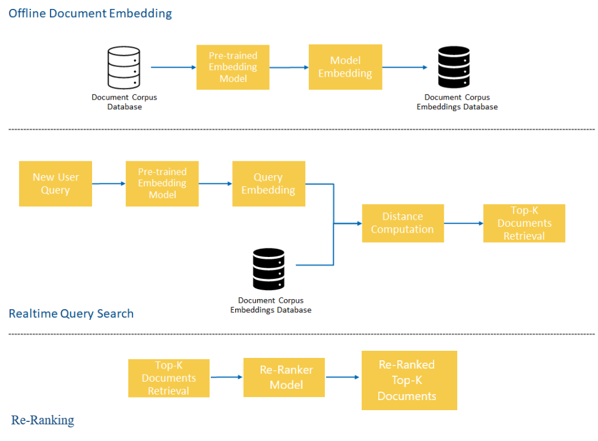
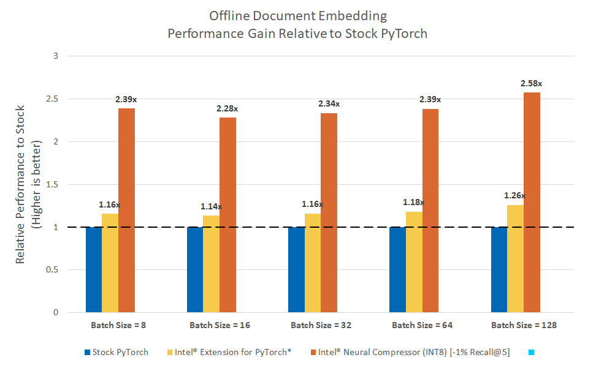
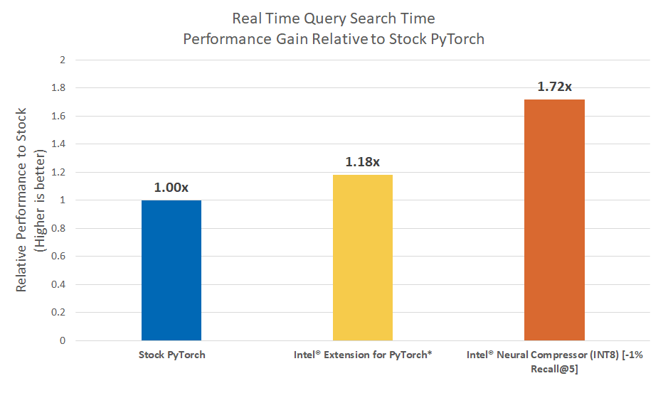

# Semantic Vertical Search Engines using PyTorch and BERT

## Table of Contents
 - [Purpose](#purpose)
 - [Reference Solution](#reference-solution)
 - [Intel® Optimized Solution](#optimizing-the-e2e-reference-solution-with-intel%C2%AE-oneapi)
 - [Performance Observations](#performance-observations)
 - [Appendix & Experiment Setup](#appendix)

## Purpose

 In this reference kit, we demonstrate a possible reference implementation of a Deep Learning based NLP pipeline for **semantic search** of an organization's documents. More specifically, we will show how to use a pre-trained language model

   1. encode text documents offline in a searchable format using dense vector embeddings
   2. embed queries in real time to search the saved, document embeddings to find semantically similar answers  

This pipeline is further accelerated by Intel® OneAPI using the Intel® Extension for PyTorch* and Intel® Neural Compressor to speed up both tasks on Intel® hardware.
 
## Reference Solution

Semantic search systems are an improvement on traditional keyword-based search systems that enable the use of the contextual meaning within a query to find matching documents in a more intelligent way.  These systems have been shown to provide better results and user experiences, especially when queries are specified in a natural language format.  The key component in building effective semantic search systems is a method to transform queries and documents from text form into a form that captures semantic meaning.

In this reference kit, we demonstrate one state-of-the-art method that uses pre-trained Large Language Models (LLM), based on BERT and provided by the `sentence_transformers` package, to ingest raw text and transform it into a high dimensional dense vector embedding.  The new representation of the document in this vector space has been shown to effectively capture semantic meaning due to the semi-supervised techniques employed to initially train the models.  Once a body of text is mapped to this vector space, distances can be computed between queries and documents to determine how semantically similar two documents are.  

Our LLM of choice will be `sentence-transformers/msmarco-distilbert-base-tas-b`, which has been pre-trained on a corpus of real search queries and provides good out of the box performance on many information retrieval tasks that use English natural language phrases.

Deploying these techniques, the pipeline for building a semantic vertical search engine using this method consists of two primary components:

1. Offline Encoding of Documents

    This offline pipeline takes all documents that an organization owns (the corpus) and embeds them using the Large Language Model to a vector representation, saving them for later use in the 2nd pipeline.

    > Text Document => BERT Embedding => Store High Dimensional Vector Embedding

2. Real Time Semantic Search

    In the realtime pipeline, a user query is taken into the system, embedded using the same Large Language Model, and distances are computed from it to all of the saved corpus embeddings produced from the 1st pipeline.  The smallest distance corpus entries are returned as semantically similar matches.

    > Text Query => BERT Embedding => Compute Distance between Query and Saved Document Embeddings => Retrieve Top K Closest

In some situations, an organization may also wish to fine-tune and retrain the pre-trained model with their own specialized dataset in order to improve the performance of the model to documents that an organization may have.  For example, if an organization's documents are largely financial in nature, it could be useful to fine-tune these models so that they become aware of domain-specific jargon related to financial transactions or common phrases.  In this reference kit, we do not demonstrate this process but more information on training and transfer learning techniques can be found at https://www.sbert.net/examples/training/sts/README.html.

### Re-ranking

In this reference kit, we focus on the document retrieval aspect of building a vertical search engine to obtain an initial list of the top-K most similar documents in the corpus for a given query.  Often times, this is sufficient for building a feature rich system.  However, in some situations, a 3rd component,  the re-ranker, could be added to the search pipeline to improve results. In this architecture, for a given query, the *document retrieval* step will use one model to rapidly obtain a list of the top-K documents, followed by a *re-ranking* step which will use a different model to re-order the list of K retrieved documents before returning to the user.  The second re-ranking refinement step has been shown to improve user satisfaction, especially when fine-tuned on a custom corpus, but may be unnecessary as a starting point for building a functional vertical search engine.  To know more about re-ranker, we direct you to https://www.sbert.net/examples/applications/retrieve_rerank/README.html for further details. In this reference kit we use `cross-encoder/ms-marco-MiniLM-L-6-v2` model as re-ranker. For more details about different re-ranker models visit https://www.sbert.net/docs/pretrained-models/ce-msmarco.html.

### Key Implementation Details

The reference kit implementation is a reference solution to the described use case that includes:

  1. A reference E2E architecture to arrive at an AI solution for a Semantic Vertical Search Engine with PyTorch using Large Language Models
  2. An Optimized reference E2E architecture enabled with Intel® Extension for PyTorch* and Intel® Neural Compressor available as part of Intel® AI Analytics Toolkit. 

### Reference Implementation

### E2E Architecture



### Expected Input-Output

We list the expected Input-Output for the 2 components detailed above:

1. Offline Embedding of Documents
   
    |   **Input**   |       **Output**       |
    | :-----------: | :--------------------: |
    | Text Document | Dense Vector Embedding |

    | **Example Input** |                   **Example Output**                    |
    | :---------------: | :-----------------------------------------------------: |
    | Abraham Lincoln ( ; February 12, 1809 – April 15, 1865) was an American politician and lawyer who served as the 16th President of the United States from March 1861 until his assassination in April 1865. Lincoln led the United States through its Civil War—its bloodiest war and perhaps its greatest moral, constitutional, and political crisis. In doing so, he preserved the Union, paved the way to the abolition of slavery, strengthened the federal government, and modernized the economy.                | [-0.12000261, 0.01448196, ..., -0.3580838, 0.7535474] |

2. Real Time Semantic Search

    | **Input**  |                 **Output**                 |
    | :--------: | :----------------------------------------: |
    | Text Query | Top-K Closest Document in the Corpus |

    | **Example Input** |                   **Example Output**                    |
    | :---------------: | :-----------------------------------------------------: |
    | Are Ferocactus and Sliene both type of plant?  | ``` {"query" : "Are Ferocactus and Sliene both type of plant?", results = ["Apiaceae or Umbelliferae, is a family of mostly aromatic flowering plants named after the type genus \"Apium\" and commonly known as the celery, carrot or parsley family. It is the 16th-largest family of flowering plants, with more than 3,700 species in 434 genera including such well-known and economically important plants such as angelica, anise, asafoetida, caraway, carrot, celery, chervil, coriander, cumin, dill, fennel, hemlock, lovage, cow parsley, parsley, parsnip, sea holly, giant hogweed and silphium (a plant whose identity is unclear and which may be extinct).", "Asteraceae or Compositae (commonly referred to as the aster, daisy, composite, or sunflower family) is a very large and widespread family of flowering plants (Angiospermae).", ...]}``` |

### Offline Embedding of the Document Corpus

Following the previously described pipeline, our reference solution starts by using the pre-trained Large Language Model to convert, or embed, every single document in the corpus to a dense vector.  The resulting embeddings will be stored in a file for use in the real time semantic search component.  For our purposes, and because our document corpus is not massive, these will be stored  into a file as a `numpy` array of dimension `n_docs x embedding_dim`.  In larger production pipelines, these can be stored in a database that allows for vector embeddings.

### Real Time Semantic Search

When a new query arrives into the system, we will pass it into the same pre-trained Large Language Model to create a dense vector embedding of it.  After loading the `numpy` array of document embeddings from the offline component, we will compute the cosine similarity score between the query and each document.  From this, we will return the K closest based on the similarity score.

### Software Requirements

1. Python
2. PyTorch v1.13

To run this reference kit, first clone this repository, which can be done using

```shell
git clone https://www.github.com/oneapi-src/vertical-search-engine
cd vertical-search-engine
```

> **Note**: If you wish to explore the reference kits on machines using Windows, first go to the [Running on Windows](#running-on-windows) section to ensure that WSL is setup, then return here.

> **Note**: The performance measurements were captured on Xeon based processors. The instructions will work on WSL, however some portions of the ref kits may run slower under that setup. Additionally performance claims reported may not be seen on a Windows based client machine.

This reference kit implementation already provides the necessary scripts to setup the above software requirements. To utilize these environment scripts, first install Anaconda/Miniconda by following the instructions at

https://docs.conda.io/projects/conda/en/latest/user-guide/install/index.html


### Reference Solution Setup

The `setupenv.sh` can be used to automate the creation of a conda environment for execution of the algorithms using the statements below.

```shell
bash setupenv.sh
1. stock
2. intel
? 1
```

This script utilizes the dependencies found in the `env/stock/stock.yml` file to create an environment as follows:

|     **YAML file**     | **Environment Name** |        **Configuration**        |
| :-------------------: | :------------------: | :-----------------------------: |
| `env/stock/stock.yml` |     `vse_stock`      | Python=3.8.x with PyTorch v1.13 |

For the workload implementation to arrive at first level reference solution we will be using the stock environment.

### Dataset

The dataset used for demonstration in this reference implementation is a question-answering dataset called HotpotQA[1] constructed of a corpus of short answers and a set of queries built on top of the corpus.  This is a diverse dataset without any focus on a particular area.  The original source of the dataset can be found at https://hotpotqa.github.io/.

For demonstration purposes, we will be truncating the document corpus for this dataset from ~2M entries to 200k for embedding, and 5k for quantization experiments.  To prepare the dataset for use, you can use the provided `data/download_data.py` script which downloads a pre-compiled version of this dataset using the `dataset` package provided by HuggingFace and distributed by the Benchmarking IR project (https://github.com/beir-cellar/beir [2]).

The following commands download the full dataset after creating the above conda environment and creates truncated versions of the original corpus for use within this reference implementation.

```shell
cd data
conda activate vse_stock
python download_data.py
cd ..
```

[1] Yang, Zhilin, et al. "HotpotQA: A dataset for diverse, explainable multi-hop question answering." arXiv preprint arXiv:1809.09600 (2018).

[2] Thakur, Nandan, et al. "BEIR: A heterogenous benchmark for zero-shot evaluation of information retrieval models." arXiv preprint arXiv:2104.08663 (2021).


> **Please see this data set's applicable license for terms and conditions. Intel Corporation does not own the rights to this data set and does not confer any rights to it.**
> **HotpotQA is distributed under a [CC BY-SA 4.0 License](https://creativecommons.org/licenses/by-sa/4.0/).**

### Reference Implementation

#### Offline Embedding of Documents Process

We will be using the pre-trained `sentence-transformers/msmarco-distilbert-base-tas-b` model to embed all of the documents in a corpus into vector representations.  In order to do this, we have provided the `run_document_embedder.py` script, which *reads a model config file*, *reads the data*, *embeds the documents into a vector format*, and *saves the embeddings for future use*.

The script takes the following arguments:

```shell
usage: run_document_embedder.py [-h] [--logfile LOGFILE] --vse_config VSE_CONFIG --input_corpus INPUT_CORPUS [--output_file OUTPUT_FILE] [--batch_size BATCH_SIZE] [--benchmark_mode] [--n_runs N_RUNS] [--intel]

optional arguments:
  -h, --help                      show this help message and exit
  --logfile LOGFILE               Log file to output benchmarking results to.
  --vse_config VSE_CONFIG         Vertical Search Engine model config yml
  --input_corpus INPUT_CORPUS     path to corpus to embed
  --output_file OUTPUT_FILE       file to output corpus embeddings to
  --batch_size BATCH_SIZE         batch size for embedding. defaults to 32.
  --benchmark_mode                toggle to benchmark embedding
  --n_runs N_RUNS                 number of iterations to benchmark embedding
  --intel                         use intel pytorch extension to optimize model
```

To perform offline document embedding of our corpus, we can run the commands:
```shell
cd src
conda activate vse_stock
python run_document_embedder.py --vse_config configs/vse_config_base.yml --input_corpus ../data/corpus_abbreviated.csv --output_file ../saved_output/embeddings.pkl
cd ..
```

which will embed all of the corpus entries in the corpus_abbreviated.csv file and output a saved embeddings file to `saved_output/embeddings.pkl`.  The model config file is provided to you here, which sets the pre-trained model to use and the max sequence length.

#### Real Time Semantic Search

Once an embeddings file is created using the above process, the `run_query_search.py` script can be run to find the K closest documents for a set of queries provided in a queries file.

The script takes the following arguments:

```shell
usage: run_query_search.py [-h] [--logfile LOGFILE] --vse_config VSE_CONFIG --input_queries INPUT_QUERIES [--output_file OUTPUT_FILE] [--batch_size BATCH_SIZE] [--benchmark_mode] [--n_runs N_RUNS] [--intel]

optional arguments:
  -h, --help                      show this help message and exit
  --logfile LOGFILE               Log file to output benchmarking results to.
  --vse_config VSE_CONFIG         Vertical Search Engine model config yml
  --input_queries INPUT_QUERIES   path to corpus to embed
  --output_file OUTPUT_FILE       file to output top k documents to
  --batch_size BATCH_SIZE         batch size for embedding
  --benchmark_mode                toggle to benchmark embedding
  --n_runs N_RUNS                 number of iterations to benchmark embedding
  --intel                         use intel pytorch extension to optimize model
  --use_re_ranker                 toggle to use cross encoder re-ranker model
  --input_corpus INPUT_CORPUS     path to corpus to embed
```

To perform realtime query search using the above set of saved corpus embeddings and the provided configuration file, which points to the saved embeddings file, we can run the commands:

```shell
cd src
conda activate vse_stock
python run_query_search.py --vse_config configs/vse_config_base.yml --input_queries ../data/test_queries.csv --output_file ../saved_output/rankings.json --use_re_ranker --input_corpus ../data/corpus_abbreviated.csv
cd ..
```

which outputs a json file of the *the Top 10 closest document indices with scores* for each query in the provided input queries.

#### Displaying Results

For convenience sake, we have included the `display_rankings.py` script to better print the rankings:.

The script takes the following arguments:

```shell
usage: display_rankings.py [-h] --rankings_file RANKINGS_FILE --queries QUERIES --corpus CORPUS

optional arguments:
  -h, --help                       show this help message and exit
  --rankings_file RANKINGS_FILE    rankings from query search
  --queries QUERIES                raw queries file
  --corpus CORPUS                  raw corpus file
```

Using the above saved rankings, we can run the commands:

```shell
cd src
conda activate vse_stock
python display_rankings.py --rankings_file ../saved_output/rankings.json --queries ../data/test_queries.csv --corpus ../data/corpus_abbreviated.csv
cd ..
```

which will pretty-print the rankings in JSON format and can be redirected to another file to save the results.

## Optimizing the E2E Reference Solution with Intel® oneAPI

On a production scale implementation, with millions of potential documents from various systems, it is necessary to optimize compute without leaving any performance on the table.  To utilize all of the hardware resources efficiently, software optimizations cannot be ignored.

This reference kit extends to demonstrate the advantages of using the Intel® Extension for PyTorch* to both Offline Encoding of Documents in batch and Real Time Semantic Search.  The savings gained from using Intel® technologies can result in faster offline processes for large datasets and also more efficient real time queries with lower retrieval latency.

### Optimized E2E Architecture with Intel® oneAPI Components

### Intel® Optimized Offline Document Embedding Decision Flow


### IIntel® Optimized Offline Realtime Query Search Decision Flow


### Optimized Software Components

#### Intel® Extension for PyTorch

The Intel® Extension for PyTorch* extends PyTorch with optimizations for an extra performance boost on Intel® hardware. Most of the optimizations will be included in stock PyTorch releases eventually, and the intention of the extension is to deliver up-to-date features and optimizations for PyTorch on Intel® hardware, examples include AVX-512 Vector Neural Network Instructions (AVX512 VNNI) and Intel® Advanced Matrix Extensions (Intel® AMX).

#### Intel® Neural Compressor

Intel® Neural Compressor is an open-source Python* library designed to help you quickly deploy low-precision inference solutions on popular Deep Learning frameworks such as TensorFlow*, PyTorch*, MXNet*, and ONNX* (Open Neural Network Exchange) runtime. The tool automatically optimizes low-precision recipes for Deep Learning models to achieve optimal product objectives, such as inference performance and memory usage, with expected accuracy criteria.

### Optimized Reference Solution Setup

The `setupenv.sh` can be used to automate the creation of an Intel® oneAPI optimized conda environment for execution of the algorithms using the statements below.

```shell
bash setupenv.sh
1. stock
2. intel
? 2
```
This script utilizes the dependencies found in the `env/intel/intel.yml` file to create an environment as follows:

|     **YAML file**     | **Environment Name** |                                 **Configuration**                                 |
| :-------------------: | :------------------: | :-------------------------------------------------------------------------------: |
| `env/intel/intel.yml` |     `vse_intel`      | Python=3.8.x, Intel® Extension for PyTorch* v1.13, Intel® Neural Compressor v1.14.2 |

### Dataset

We will use the same dataset to build the optimized solution as we used in the stock solution.  To set this up, if not already setup, please see the instructions in the stock reference solution section.

### Optimized Reference Solution Implementation

An optimized implementation of training and inference of PyTorch models which leverages Intel® CPU architectures and instruction sets, such as AVX512, can be built by using Intel® Extension for PyTorch*. Further optimizations for Intel® CPUs can be obtained by using Intel® Neural Compressor to quantize a trained model to INT8 format.  This reference kit provides code for the same embedding processes as before, but optimized via these techniques and packages.  We will now detail the optimizations that we implement.

#### Intel® Optimizations using Intel® Extension for PyTorch*

The Intel® Extension for PyTorch* can be used to optimize some PyTorch model architectures for Intel® CPU architectures and instruction sets.  These optimizations include **additional CPU specific optimizations**.  In this optimized reference implementation, we optimize our embedding scripts using both of these methods.  More details about this package can be found at [the Intel® Extension for PyTorch* github](https://github.com/intel/intel-extension-for-pytorch).

***Additional CPU Specific Optimizations***

Many of the Intel® optimizations for PyTorch are directly upstreamed to the main PyTorch project.  These optimizations can directly be utilized by updating the version of PyTorch that is being used.  In addition to the upstreamed optimizations, the Intel® Extension for PyTorch* provides additional CPU specific optimizations to a PyTorch model that are not upstreamed and can be applied via few modifications to the code.  In our implementation, these additional optimizations can be toggled on in the `vse_intel` environment for both the `run_document_embedding.py` and the `run_query_search.py` scripts by adding the `--intel` flag.  

Maximizing the performance of these optimizations depends on the details of the runtime machine.  The Intel® Extension for PyTorch* provides a command line launch script, `ipexrun`, to automatically detect and configure some of the optimizations settings based on your machine.  More information about this can be found at the [Intel® Extension for PyTorch* launch script usage guide](https://intel.github.io/intel-extension-for-pytorch/cpu/latest/tutorials/performance_tuning/launch_script.html).  In the following sections, we will default to use `ipexrun` to automatically configure the optimizations to our environment.  

***Note***

By default, the launch script uses the `numactl` tool.  To install this, on Ubuntu machines, use `sudo apt-get install numactl`.  Alternatively, this can be disabled by adding the `--disable_numactl` flag to all of the commands that use ipexrun.  For example `ipexrun --use_logical_core --enable_tcmalloc --disable_numactl script.py [flags]`.

To perform document embedding with these additional optimizations and the `ipexrun` tool, we can run the commands:

```shell
cd src
conda activate vse_intel
ipexrun --use_logical_core --enable_tcmalloc run_document_embedder.py --vse_config configs/vse_config_base.yml --input_corpus ../data/corpus_abbreviated.csv --output_file ../saved_output/embeddings.pkl --intel --use_re_ranker --input_corpus ../data/corpus_abbreviated.csv
cd ..
```

To perform query searches with these additional optimizations and the `ipexrun` tool, we can run the commands:

```shell
cd src
conda activate vse_intel
ipexrun --use_logical_core --enable_tcmalloc run_query_search.py --vse_config configs/vse_config_base.yml --input_queries ../data/test_queries.csv --output_file ../saved_output/rankings.json --intel --use_re_ranker --input_corpus ../data/corpus_abbreviated.csv
cd ..
```

#### Model Quantization using Intel® Neural Compressor

Another level of optimization that we can use to accelerate our models is Model quantization.  Model quantization is the practice of converting the FP32 weights in Deep Neural Networks to a lower precision, such as INT8 in order **to accelerate computation time and reduce storage space of trained models**.  This may be useful if latency and throughput are critical, especially for larger models such as these Large Language Models. To add this feature to our reference kit, we will be using Intel® Neural Compressor (INC), an extensive library with multiple algorithms for compressing trained Deep Neural Network models.  More details can be found at https://github.com/intel/neural-compressor.  

The model compression algorithm we choose for this reference kit is Accuracy Aware Quantization, a quantization technique which adds an accuracy requirement when choosing how to convert which weights from FP32 to INT8.  This is useful when a faster model is needed, but the full quantization may affect accuracy to an unacceptable degree.

The provided script, `run_quantize_inc.py`, can be used to perform Accuracy Aware Quantization of our trained PyTorch models using the configuration file `conf.yml`:

The `run_quantize_inc.py` script takes the following arguments:

```shell
usage: run_quantize_inc.py [-h] --query_file QUERY_FILE --corpus_file CORPUS_FILE --ground_truth_file GROUND_TRUTH_FILE --vse_config VSE_CONFIG [--batch_size BATCH_SIZE] --save_model_dir SAVE_MODEL_DIR --inc_config_file INC_CONFIG_FILE

optional arguments:
  -h, --help                               show this help message and exit
  --query_file QUERY_FILE                  query file to use for AAQ
  --corpus_file CORPUS_FILE                corpus file to use for AAQ
  --ground_truth_file GROUND_TRUTH_FILE    table of query-id and matching corpus-id to evaluate accuracy
  --vse_config VSE_CONFIG                  Vertical Search Engine model config yml
  --batch_size BATCH_SIZE                  batch size to use. Defaults to 32.
  --save_model_dir SAVE_MODEL_DIR          directory to save the quantized model to
  --inc_config_file INC_CONFIG_FILE        INC conf yaml
  --use_re_ranker                          toggle to use cross encoder re-ranker model
  --input_corpus INPUT_CORPUS              path to corpus to embed
```

which can be used for our models as follows:

```shell
cd src
conda activate vse_intel
python run_quantize_inc.py --query_file ../data/quant_queries.csv --corpus_file ../data/corpus_quantization.csv --ground_truth_file ../data/ground_truth_quant.csv --vse_config configs/vse_config_inc.yml --save_model_dir ../saved_models/inc_int8 --inc_config_file conf.yml --use_re_ranker --input_corpus ../data/corpus_abbreviated.csv
cd ..
```

to outputs a quantized model, if successful, to `saved_models/inc_int8/`.

As our data comes with a ground truth file only containing an un-ranked list of queries and their correctly retrieved corpus results, the accuracy metric we consider here is the ability for the model to retrieve the ground truth corpus entries for a given query within it's top K, also known as Recall@K.  This can be defined, letting $D$ be the number of ground truth entries, as:

<!--
$$
\text{Recall@K} = \sum_{i = 1}^{D} \frac{\{\text{1, if ground truth document $i$ for query $j$ is in Top-K retrieved documents for query $j$, else 0}\}}{\vert D \vert} 
$$
Here, D is the total number of entries in the ground truth file.
-->


[Many more information retrieval metrics](https://en.wikipedia.org/wiki/Evaluation_measures_(information_retrieval)) can be used aside from the one we use to calibrate the quantized model according to your application needs.

For accuracy aware quantization, we set the maximum Recall@5 drop to 1% and quantize the model until it can achieve that level of accuracy.

From our experiments, on the quantization dataset, the original FP32 model obtains a Recall@5 of 90% while the model quantized with Intel® Neural Compressor obtains a Recall@5 of 89%, but offers significant computational benefits. 


#### Offline Document Embedding and Realtime Query Search Using Intel® Neural Compressor Quantized Model

The quantized model can be easily be used for embedding and query searching using the same previous scripts, but passing in the newly saved INC model via the `--vse_config` file, which we have included a default version for.

To do offline document embedding, we can run the commands: 

```shell
cd src
conda activate vse_intel
ipexrun --use_logical_core --enable_tcmalloc run_document_embedder.py --vse_config configs/vse_config_inc.yml --input_corpus ../data/corpus_abbreviated.csv --output_file ../saved_output/embeddings.pkl --intel --use_re_ranker --input_corpus ../data/corpus_abbreviated.csv
cd ..
```

To do realtime query searching, we can run the commands:

```shell
cd src
conda activate vse_intel
ipexrun --use_logical_core --enable_tcmalloc run_query_search.py --vse_config configs/vse_config_inc.yml --input_queries ../data/test_queries.csv --output_file ../saved_output/rankings.json --intel --use_re_ranker --input_corpus ../data/corpus_abbreviated.csv
cd ..
```

As in the reference implementation, we can pretty-print the new rankings saved to the `rankings.json` using the commands:

```shell
cd src
conda activate vse_intel
python display_rankings.py --rankings_file ../saved_output/rankings.json --queries ../data/test_queries.csv --corpus ../data/corpus_abbreviated.csv
cd ..
```


## Performance Observations

In the following, we report some results comparing the Intel® technologies vs the stock alternative on the following 2 primary set of experiments:

### 1. Offline Batch Corpus Embedding with Intel® Extension for PyTorch\* & Intel® Neural Compressor

To build a semantic vertical search engine powered by Deep Learning methods, the first step for an organization is to embed all of their documents into a dense, vector searchable format using the embedding model.  This process is generally run offline, and for large document stores, can take a substantial amount of time to process, resulting in potential delays between when a document is ingested and when it becomes searchable.  

We conduct benchmarks on offline embedding of documents across various batch sizes while using the selected model, comparing stock FP32 PyTorch vs. Intel® Extension for PyTorch* FP32 with optimizations vs. Intel® Neural Compressor INT8 with sequence lengths of 128.

### 2. Real Time Search with Intel® Extension for PyTorch\* & Intel® Neural Compressor

The retrieval step of a semantic vertical search engine must retrieve documents for a given query on demand.  In this case, we care about the performance of the model for embedding a single query and computing distance computations to all of the saved embeddings.

We conduct benchmarks on real time search of documents for a single query, comparing stock FP32 PyTorch vs. Intel® Extension for PyTorch* FP32 with optimizations vs. Intel® Neural Compressor INT8 with sequence lengths of 128.

### Results Summary

#### Offline Document Embeddings Across Different Batch Sizes


#### Realtime Query Search



### Key Take Aways & Conclusion

In this reference kit, we demonstrate a starter solution for building a custom semantic vertical search engine using modern Deep Learning based Large Language Models.  This is a two step process involving running an offline process to batch encode all of the documents in a corpus, and then running a realtime process capable of embedding a query and computing distances to the offline embedded documents. 

Furthermore, we demonstrate how to use the **Intel® oneAPI AI toolkit to speed up both offline batch encodings of documents and realtime query search**.  For batch encoding, we are able to see up to a 2.58x boost in performance while for real time query search, we are able to see up to a 1.72x boost in performance.  

We implore you to expand this reference solution to fit you custom needs, adding new components to your pipeline as necessary.

## Notices & Disclaimers
Performance varies by use, configuration and other factors. Learn more on the [Performance Index site](https://edc.intel.com/content/www/us/en/products/performance/benchmarks/overview/).<br>
Performance results are based on testing as of dates shown in configurations and may not reflect all publicly available updates.  See backup for configuration details.  No product or component can be absolutely secure. <br>
Your costs and results may vary. <br>
Intel technologies may require enabled hardware, software or service activation.<br>
© Intel Corporation.  Intel, the Intel logo, and other Intel marks are trademarks of Intel Corporation or its subsidiaries.  Other names and brands may be claimed as the property of others.  <br>

## Appendix

### Running on Windows

The original reference kits commands were built using a Linux based system.  In order to run these commands on Windows, go to Start and open WSL.  The Linux instructions provided can then be run in the WSL window starting from the git clone instructions. If WSL is not installed you can [install WSL](https://learn.microsoft.com/en-us/windows/wsl/install).

> **Note** If WSL is installed and not opening, goto Start ---> Turn Windows feature on or off and make sure Windows Subsystem for Linux is checked. Restart the system after enabling it for the changes to reflect.

### Experiment Setup
- Testing performed on: January 2023
- Testing performed by: Intel Corporation
- Configuration Details: Azure D4v8 (Intel® Xeon® Platinum 8370C CPU @ 2.80GHz), 1 Socket, 4 Cores per Socket, 2 Threads per Core, Turbo:On, Total Memory: 32 GB, OS: Ubuntu 20.04, Kernel: Linux 5.13.0-1031-azure , Software: PyTorch v1.13, Intel® Extension for PyTorch* v1.13.0, Intel® Neural Compressor v1.14.2    

| **Optimized for**:  | **Description**                                                                           |
| :------------------ | :---------------------------------------------------------------------------------------- |
| Platform            | Azure Standard D4v5 : Intel Xeon Platinum 8370C (Ice Lake) @ 2.80GHz, 8 vCPU, 32GB memory |
| Hardware            | CPU                                                                                       |
| OS                  | Ubuntu 20.04                                                                              |
| Software            | PyTorch v1.13, Intel® Extension for PyTorch* v1.13.0, Intel® Neural Compressor v1.14.2       |
| What you will learn | Intel® oneAPI performance advantage over the stock versions                               |


To replicate the performance experiments described above, do the following:

1. Download and setup Anaconda/Miniconda from the following link https://docs.conda.io/projects/conda/en/latest/user-guide/install/index.html

2. Clone this repository

    ```bash
    git clone https://www.github.com/oneapi-src/vertical-search-engine
    ```

3. Setup the conda environment for stock and intel using the setupenv.sh script

    ```bash
    bash setupenv.sh 
    1
    bash setupenv.sh 
    2
    ```

4. Download and prepare the dataset following the instructions [here](data).  
     
    ```bash
    cd data
    conda activate vse_stock
    python download_data.py
    ```

5. For the stock environment, run the following to run and log results to the ../logs/stock.log file
   
    ```bash
    cd src
    conda activate vse_stock

    # Run batch size document embedding experiments
    python run_document_embedder.py --vse_config configs/vse_config_base.yml --input_corpus ../data/corpus_abbreviated.csv --logfile ../logs/stock.log --batch_size 8 --benchmark_mode
    python run_document_embedder.py --vse_config configs/vse_config_base.yml --input_corpus ../data/corpus_abbreviated.csv --logfile ../logs/stock.log --batch_size 16 --benchmark_mode
    python run_document_embedder.py --vse_config configs/vse_config_base.yml --input_corpus ../data/corpus_abbreviated.csv --logfile ../logs/stock.log --batch_size 32 --benchmark_mode
    python run_document_embedder.py --vse_config configs/vse_config_base.yml --input_corpus ../data/corpus_abbreviated.csv --logfile ../logs/stock.log --batch_size 64 --benchmark_mode
    python run_document_embedder.py --vse_config configs/vse_config_base.yml --input_corpus ../data/corpus_abbreviated.csv --logfile ../logs/stock.log --batch_size 128 --benchmark_mode

    # Get the full 200k corpus (long run time!)
    python run_document_embedder.py --vse_config configs/vse_config_base.yml --input_corpus ../data/corpus_abbreviated.csv --output_file ../saved_output/embeddings.pkl --batch_size 64

    # Run benchmarks on single query search
    python run_query_search.py --vse_config configs/vse_config_base.yml --input_queries ../data/test_queries.csv --benchmark_mode --n_runs 10000 --batch_size 1 --logfile ../logs/stock.log --input_corpus ../data/corpus_abbreviated.csv
    ```

6. For the intel environment, run the following to run and log results to the ../logs/intel.log file
  
    ```bash
    cd src
    conda activate vse_intel

    # Run batch size document embedding experiments using IPEX
    ipexrun --use_logical_core --enable_tcmalloc run_document_embedder.py --vse_config configs/vse_config_base.yml --input_corpus ../data/corpus_abbreviated.csv --logfile ../logs/intel.log --batch_size 8 --benchmark_mode --intel
    ipexrun --use_logical_core --enable_tcmalloc run_document_embedder.py --vse_config configs/vse_config_base.yml --input_corpus ../data/corpus_abbreviated.csv --logfile ../logs/intel.log --batch_size 16 --benchmark_mode --intel
    ipexrun --use_logical_core --enable_tcmalloc run_document_embedder.py --vse_config configs/vse_config_base.yml --input_corpus ../data/corpus_abbreviated.csv --logfile ../logs/intel.log --batch_size 32 --benchmark_mode --intel
    ipexrun --use_logical_core --enable_tcmalloc run_document_embedder.py --vse_config configs/vse_config_base.yml --input_corpus ../data/corpus_abbreviated.csv --logfile ../logs/intel.log --batch_size 64 --benchmark_mode --intel
    ipexrun --use_logical_core --enable_tcmalloc run_document_embedder.py --vse_config configs/vse_config_base.yml --input_corpus ../data/corpus_abbreviated.csv --logfile ../logs/intel.log --batch_size 128 --benchmark_mode --intel

    # Get the full 200k corpus (long run time!)
    # If this was run in the stock implementation, this step can be skipped
    # and the corpus embeddings can be reused for benchmarking purposes
    ipexrun --use_logical_core --enable_tcmalloc run_document_embedder.py --vse_config configs/vse_config_base.yml --input_corpus ../data/corpus_abbreviated.csv --output_file ../saved_output/embeddings.pkl --batch_size 64 --intel

    # Run single query search experiments using IPEX
    ipexrun --use_logical_core --enable_tcmalloc run_query_search.py --vse_config configs/vse_config_base.yml --input_queries ../data/test_queries.csv --benchmark_mode --n_runs 10000 --batch_size 1 --logfile ../logs/intel.log --intel --input_corpus ../data/corpus_abbreviated.csv

    # Quantize the model using INC (long run time!)
    python run_quantize_inc.py --query_file ../data/quant_queries.csv --corpus_file ../data/corpus_quantization.csv --ground_truth_file ../data/ground_truth_quant.csv --vse_config configs/vse_config_inc.yml --save_model_dir ../saved_models/inc_int8 --inc_config_file conf.yml 

    # Run batch size document embedding experiments using INC INT8
    ipexrun --use_logical_core --enable_tcmalloc run_document_embedder.py --vse_config configs/vse_config_inc.yml --input_corpus ../data/corpus_abbreviated.csv --logfile ../logs/intel_inc_int8.log --batch_size 8 --benchmark_mode --intel
    ipexrun --use_logical_core --enable_tcmalloc run_document_embedder.py --vse_config configs/vse_config_inc.yml --input_corpus ../data/corpus_abbreviated.csv --logfile ../logs/intel_inc_int8.log --batch_size 16 --benchmark_mode --intel
    ipexrun --use_logical_core --enable_tcmalloc run_document_embedder.py --vse_config configs/vse_config_inc.yml --input_corpus ../data/corpus_abbreviated.csv --logfile ../logs/intel_inc_int8.log --batch_size 32 --benchmark_mode --intel
    ipexrun --use_logical_core --enable_tcmalloc run_document_embedder.py --vse_config configs/vse_config_inc.yml --input_corpus ../data/corpus_abbreviated.csv --logfile ../logs/intel_inc_int8.log --batch_size 64 --benchmark_mode --intel
    ipexrun --use_logical_core --enable_tcmalloc run_document_embedder.py --vse_config configs/vse_config_inc.yml --input_corpus ../data/corpus_abbreviated.csv --logfile ../logs/intel_inc_int8.log --batch_size 128 --benchmark_mode --intel

    # Run single query search experiments using INC INT8
    ipexrun --use_logical_core --enable_tcmalloc run_query_search.py --vse_config configs/vse_config_inc.yml --input_queries ../data/test_queries.csv --benchmark_mode --n_runs 10000 --batch_size 1 --logfile ../logs/intel_inc_int8.log --intel --input_corpus ../data/corpus_abbreviated.csv

    ```

### Known Issues

1. libGL.so not found
   
    If you run into an issue with 
    ```
    ImportError: libGL.so.1: cannot open shared object file: No such file or directory
    ```
    please install the libgl1-mesa-glx library.  For Ubuntu, this will be: 

    ```bash
    apt install libgl1-mesa-glx
    ```
    